# MultiTerm Workbench Help

MultiTerm Workbench is a Windows terminal workspace for running PowerShell 7, Windows PowerShell, Command Prompt, and WSL sessions side by side. Everything in this guide is available from the app's top-right **?** button.

## Getting started

1. Choose a shell from the header.
2. Optionally enter a name and working directory.
3. Select **Add terminal** or press <kbd>Ctrl+N</kbd> or <kbd>Ctrl+Shift+T</kbd>.
4. Click a pane to make it active, then type normally.

Use the terminal, page, and empty-workspace context menus for additional actions. Press <kbd>F1</kbd> to open this in-app help guide, or <kbd>Ctrl+Shift+P</kbd> to search the command palette. While Help is open, <kbd>Ctrl+F</kbd> searches this guide and highlights every match. Use <kbd>Enter</kbd> / <kbd>Shift+Enter</kbd> for the next / previous match; select `.*` only when the query should be treated as a regular expression.

## Terminals

### Supported shells

- **PowerShell 7** (`pwsh`)
- **Windows PowerShell** (`powershell.exe`)
- **Command Prompt** (`cmd.exe`)
- **WSL**, including attachment to existing tmux sessions

Each terminal has its own shell process, PID, working directory, title, color label, scrollback, and optional log file.

### Common pane actions

Right-click a pane or its title bar to:

- copy, paste, select, find, clear, or restart;
- open the current folder in File Explorer;
- create another terminal in the same folder;
- split by duplicating the shell and working directory;
- launch the configured AI assistant or resume one of its local sessions;
- run a script, optionally in an Administrator terminal;
- start or stop logging;
- inspect statistics;
- open notes and the command queue;
- move the terminal to another page; or
- minimize, maximize, recolor, rename, or close the pane.

Choose **Header background...** to style only the terminal header you right-clicked. The **palette** button beside that terminal's bell is the quick route: it opens a small flyout centered under the button with one-click colors, **Your colors**, **Use default**, and **More options...** for the full editor. Select **+** under **Your colors** to open the native color picker and add one reusable color at a time, up to six. Each saved swatch applies its gradient with one click and has an **x** button to remove only that color; removing one restores **+**. MultiTerm never evicts a saved color to make room for another, and choosing a color that already exists or is already a preset does not consume another slot. The editor supports linear, radial, and conic gradients with adjustable angle or center, two to eight color stops, arbitrary colors, opacity, and stop positions. Your edits preview live on the pane header itself, so what you see is exactly what you get; **Apply** stores the result with that terminal, **Use default** removes the override, and **Cancel** reverts the header to how it looked before you opened the editor. Color stops re-sort themselves once you finish editing a position. Header backgrounds survive renderer reloads, session restoration, terminal restart or duplication, and saved workspace restoration. Elevated (Administrator) and awaiting-input headers keep their warning colors, which always take precedence over a custom background. The separate **Cycle color** action still controls the pane's label accent.

The terminal context menu organizes these actions into two columns of named groups. Its search field is focused immediately, so you can type an action name without an extra click. Press <kbd>Down</kbd> or <kbd>Tab</kbd> to enter the filtered results, then use the arrow keys and Enter. On narrow windows the groups collapse to one column.

Customize that menu directly:

- drag the grip at the right edge of an action to reorder it within a section or move it into another section; the rest of the row remains click-only;
- drag the grip beside a section heading to move the entire section;
- select a section heading to rename it;
- open a section's **...** menu to rename or remove it (its actions move to the nearest remaining section);
- select **Add section** at the bottom-left to create and name a new section; or
- right-click an action and choose **Hide item**.

When at least one action is hidden, **Show hidden items** appears at the bottom-right. Revealed hidden actions remain disabled so they cannot run accidentally; right-click one and choose **Show item** to restore it. Section names, custom sections, action order, placement, and hidden actions are stored in the current browser profile and merge with newly added application actions after an upgrade.

Choose **Run GitHub Copilot** or **Run Claude** from a terminal or blank-workspace right-click menu to start the configured interactive assistant with its selected model, thinking effort, and context options. In the terminal menu these live in the **AI assistant** group, together with the worktree launch, session resume, and the model and directory fields. Copilot launches with `copilot --yolo`; Claude launches with `claude --dangerously-skip-permissions`. If no terminal has keyboard focus, MultiTerm opens one on the current page and runs the command after its shell is ready. The action is disabled when the selected provider is not installed and signed in.

**New terminal here** uses the selected shell and current terminal folder, but assigns a fresh standard title such as **PowerShell 4** or **Command Prompt 4**. It does not copy a custom title from the terminal whose menu you opened.

Select the sparkle immediately after a terminal title to suggest a new title from that terminal's recent output. MultiTerm uses the selected title provider and shows the suggestion in place without committing it. GitHub Copilot requests use the official Copilot SDK; Claude requests use the authenticated Claude CLI's structured output. Select the green check to apply and synchronize the title, or the red X to restore the original. Configure the provider, model, thinking effort, context window, terminal-text limit, and title word range under **AI assistants** in Settings.

When **Suggest titles automatically** is on, the schedule in Settings starts after the terminal first receives meaningful input. Typed and pasted text count, as do commands sent by MultiTerm actions such as **Run GitHub Copilot**; an untouched terminal does not spend an AI request on a title. Choose **Progressive delays** to use an ordered list whose last delay repeats, or **Repeating interval** to request a suggestion at the same configurable minute interval every time. Immediately before the first automatic title request that is actually ready to run, MultiTerm shows a one-time notice for the application profile. That dialog can adjust either timing mode, continue with the pending request, or turn automatic titles off. Once shown, it never appears again, even if automatic titles are later re-enabled.

For each title request, MultiTerm sends the selected AI title provider the terminal's current title, shell type, working directory, and the most recent text in xterm's rendered active buffer: scrollback plus the current screen, with trailing blank space removed. Only the newest UTF-8 tail up to **Terminal text (KB)** is sent (4-24 KB). The request also carries the selected model, reasoning effort, provider context tier, and minimum/maximum title word counts. When GitHub Copilot is selected, this becomes a tool-free, non-persistent Copilot SDK request; no shell, MCP, built-in, or custom tools are available to that request. MultiTerm does not send the terminal PID, terminal notes, queued commands, clipboard contents, keystroke timing, input events that are no longer visible in the rendered buffer, or content from other terminals. Commands or secrets that remain visible in the selected terminal buffer can be part of the transcript, so reduce **Terminal text (KB)** or disable AI titles when that context should not leave the terminal.

Automatic suggestions present the same green check and red X for approval. An automatic suggestion never renames a terminal on its own and never takes keyboard focus, so it cannot interrupt what you are typing. If you are renaming that terminal when one arrives, it waits as a badge on the sparkle instead of replacing what you are typing; select the sparkle to review it. Right-click the sparkle to pause automatic titles for that terminal, its process, or every terminal sharing the title.

MultiTerm records every title suggestion with its timestamp, terminal title, process ID, automatic or manual source, and whether it was accepted. Select the editable title or press Down while editing it to see the five most recent suggestions associated with that terminal name or PID; select one to reuse it. The terminal hamburger menu exposes the same recent history in a flyout. Choose **View all history** there, or open **Title suggestion history** from the command palette, to search the complete retained history by title, suggestion, PID, or outcome. The history dialog shows five matches initially; **Show 5 more** reveals the next five without moving the header, search, or footer. Changing the filter starts again with the first five matches. Configure the number of retained entries with **History entries** under **AI assistants** in Settings.

Each terminal can keep multiple process-bound notes. Select its Notes button, then **Add note** to write and save directly in the flyout; each saved note has its own Edit and Delete actions. Select **Expand** while composing to continue that draft in the full notes and command-queue dialog. The full dialog lists every note for the selected terminal, lets you switch between them, create another with **New note**, and delete only the selected note. When a terminal process ends, MultiTerm recovers every note separately so one note never overwrites another.

Model, thinking effort, and context all default to **Auto (provider default)**, so each provider applies its own current default instead of MultiTerm pinning a model that ages out. The model lists are grouped by family — Anthropic Claude, OpenAI GPT, xAI Grok, Microsoft MAI, and so on — with families and their models in alphabetical order.

During an interactive installation, Setup checks whether the GitHub Copilot and Claude Code CLIs are on `PATH` and offers those detected commands, plus **Disabled**, as a first-launch preference. Executable detection does not prove sign-in or model access. On first launch, MultiTerm checks GitHub Copilot and Claude separately and asks which provider to use for terminal titles and interactive sessions. Each operation has its own model, effort, and context profile populated from the capabilities reported by the signed-in account. Either operation can remain disabled, and normal terminal features never require an AI provider. When both operations are disabled after setup, MultiTerm leaves provider processes dormant until you select **Refresh AI providers** in Settings.

If GitHub Copilot CLI is missing or signed out, select **Install and sign in** in first-launch setup, or **Set up Copilot** under **AI assistants** later. MultiTerm opens a visible PowerShell terminal and installs the CLI only when needed, using the first channel GitHub documents for Windows that this machine actually has: WinGet, then `npm install -g @github/copilot` when Node.js 22 or later is present, and otherwise the signed installer published with the official GitHub release. A downloaded installer is checked against the size and SHA-256 digest GitHub publishes for it before it runs, and the download is deleted afterwards. If none of those channels is available - for example on 32-bit Windows - MultiTerm reports what is missing and links to GitHub's installation guide instead of failing silently. The terminal's `PATH` is refreshed and `copilot` is launched. When the CLI reports that sign-in is required, MultiTerm submits `/login`; complete GitHub's browser or device flow in the CLI. MultiTerm never reads a password, device code, or token. It rechecks the local provider while the setup terminal remains open and returns to the defaults dialog as soon as the CLI and account are ready.

The terminal menu's assistant directory field remains a quick provider-specific control: it uses Copilot's `/cwd` command or Claude's `/add-dir` command. Claude's `/add-dir` grants access to another folder but does not move the session. The field remembers the last submitted value separately for each terminal. Beneath it, up to ten subdued recent values from all terminals can be selected to fill the textbox without executing it; press Enter to submit the chosen value. Per-terminal recall and the shared recent-value list persist across app restarts. The field is disabled when no interactive provider is available.

Choose **Resume GitHub Copilot session...** or **Resume Claude session...** in a terminal or blank-workspace menu to search the configured provider's local history. A terminal-menu selection continues in that terminal. The blank-workspace action and history button create a new terminal; after selecting a session, confirm, paste, or browse for its working directory before MultiTerm launches it. Cancel returns to the session picker with its search and results preserved.

If a native Copilot session has no saved working directory, or its saved directory is no longer available, MultiTerm privately resumes it in a transient terminal and asks the session to recall its previous absolute path. This prompt has no tools available and explicitly excludes the probe process's current directory. The working-directory dialog validates a reported path before enabling **Send** and provides **Ask session** to retry manually. **Session CWD query timeout (s)** under Session controls how long the private query may run. The probe does not appear in the workspace, terminal count, Quick Switch, saved workspaces, or recovery records, and its output is visible only to the renderer that started it. Cancel, timeout, or closing that renderer closes the probe. Selecting **Send** reveals that same already-resumed terminal and applies the confirmed directory, rather than starting the session a second time.

Copilot searches native CLI, VS Code, and Visual Studio sessions; native CLI sessions use `--resume`, while editor histories use a private temporary context file containing the most recent conversation text. Claude searches native Claude Code sessions and resumes them with Claude's `--resume` option. Native sessions first resume from their saved project so the provider can locate the session; if you chose another folder, MultiTerm sends Copilot `/cwd` or Claude `/cd` as soon as the resumed assistant is ready. Editor imports start directly in the confirmed folder. Configure **Imported Copilot context (KB)** under Session to control how much editor history is carried forward. Results show their source, title, working directory, ID, and last-updated time; search filters the complete catalog, and **Load more** pages through large result sets.

In the GitHub Copilot session picker, enter a natural-language request such as **Find sessions where I worked on database migration or OAuth refresh**, then select the sparkle button beside Search. Copilot searches the complete local catalog using session metadata and a fair share of recent transcript text, then filters the picker to exact validated session keys. Typing in Search again returns to ordinary literal filtering. **AI session search context (KB)** under AI assistants controls the total metadata and transcript budget for one search. If that budget cannot represent metadata for every session, MultiTerm asks you to increase it instead of silently excluding sessions.

Session cards also show the terminal notes belonging to that session, so you can tell two similar sessions apart before resuming either. The Copilot CLI never reports the ID of a session it starts, so MultiTerm supplies one with `--session-id` whenever it launches Copilot; that ID is what links a terminal's notes to the session. Because the link is an ID rather than a name, renaming a terminal never breaks it. Notes from the still-open terminal appear first, followed by the notes recovered from each terminal that has since ended. Long notes are trimmed to a preview with **Show more...** to expand the rest inline, and **Show less** to collapse it again; expanding never resumes the session. Sessions started before this existed, or started outside MultiTerm, have no recorded ID, so their notes are matched by working directory instead and the card labels them **Matched by folder**.

### Remote control of Copilot sessions

Copilot CLI can publish a running session to GitHub so you can watch it and answer its prompts from GitHub.com or GitHub Mobile while you are away from the machine. Remote control is off in MultiTerm by default. Turn on **Remote control for new Copilot sessions** under **AI assistants** and new Copilot launches start with `--remote`. While the toggle is off MultiTerm passes no flag at all, so the `remoteSessions` value in your own `~/.copilot/settings.json` still decides. Remote control is a Copilot feature; Claude launches are never affected.

Remote control also depends on your GitHub organization: an owner must set the "Store local sessions in the Cloud" policy to **View and control**. When it is not allowed, the CLI prints *Remote controlled sessions are not enabled* and the session is still synced but cannot be steered.

A running Copilot pane's menu carries a **Remote control** group. Use it to enable, disable, or redisplay the status and link, to open or copy the session link once MultiTerm has seen it, and to send `/keep-alive` so the machine does not sleep while you are steering it from elsewhere. **Keep machine awake** under **AI assistants** applies the same choice automatically to sessions started with remote control. The rows stay disabled until the pane is running Copilot and its prompt is idle, because a slash command typed into a busy TUI is discarded.

The session picker gains a **Remote** tab when it is opening a new terminal. It lists the agent sessions on your GitHub account, showing each session's state and whether it can be steered; a session that has ended or that your policy does not allow is listed but cannot be connected to, and says why. Selecting a session opens a new terminal running `copilot --connect`, which attaches to the session on the machine that is hosting it — nothing runs locally and there is no working directory to confirm.

GitHub publishes no supported API for this list, so MultiTerm reads the same endpoint the CLI itself uses, authenticating with a token from the GitHub CLI (`gh auth token`). If that call fails, or GitHub changes the response, the tab says so and falls back to the remote sessions MultiTerm itself started. **Connect by session ID** accepts an id or a github.com link containing one, and **Open Copilot remote picker** starts `copilot --connect` so the CLI's own Remote tab can find the session instead.

Use **Change working directory...** from a terminal menu, the blank-workspace menu, or the command palette to move the selected terminal independently of session resume. The dialog shows the live Copilot directory when `/cwd` can report it; otherwise it labels the tracked value as last known. Paste a path or select the folder button to browse on disk. MultiTerm validates the folder and waits for an idle shell or ready assistant prompt before enabling **Send**, so it never inserts `cd` into an unrelated foreground program. PowerShell, Command Prompt, and WSL receive their native directory command; Windows folders selected for WSL are converted and checked inside the target distribution. Claude uses `/cd`, which requires Claude Code 2.1.169 or newer and may show Claude's own trust prompt for a new folder. MultiTerm does not approve that prompt automatically.

Folder buttons open the same inline picker for working directories, repositories, and worktree locations. Enter a path directly or use Back, Forward, Up, roots, and breadcrumbs to move through the hierarchy. Typing a partial path shows matching completions. Search finds partial folder-name or path matches recursively below the current folder, highlights the matching text, and returns 100 results at a time with **Load more** when more are available. Select a row to choose it, open it with its arrow or a double-click, or create a direct child with **New folder**. An explicit path that does not exist or cannot be opened is reported instead of silently switching elsewhere.

On Windows, MultiTerm detects an existing [Everything](https://www.voidtools.com/downloads/) desktop/service installation with its `es.exe` command-line interface and then enables **Everywhere** for instant whole-computer folder search. This integration is optional: MultiTerm never downloads or installs Everything. Without it, **Current** search continues to use MultiTerm's cross-platform filesystem search. The optional reminder can be dismissed permanently with **Don't remind me again**.

Drag any terminal-header action onto the hamburger menu to move it into that menu. Open the hamburger menu and drag an action row back onto the header to restore it. The scope flyout defaults to **All terminals**; choose **This terminal** for a per-terminal layout, or select **Always take this action (don't ask me again)** to remember the scope. Change **Header drag scope** under **Terminal** to show the flyout again. Global and per-terminal placements persist across reloads and saved workspaces.

#### Terminal header action shortcuts

Every terminal-header action also answers to a keyboard shortcut, whether the action sits in the title bar or in the hamburger menu. The shipped defaults all use <kbd>Ctrl</kbd>+<kbd>Alt</kbd>+<kbd>Shift</kbd>, which nothing else in MultiTerm binds:

| Action | Default | Action | Default |
| --- | --- | --- | --- |
| Move left | <kbd>Ctrl</kbd>+<kbd>Alt</kbd>+<kbd>Shift</kbd>+<kbd>←</kbd> | Notes & command queue | <kbd>Ctrl</kbd>+<kbd>Alt</kbd>+<kbd>Shift</kbd>+<kbd>A</kbd> |
| Move right | <kbd>Ctrl</kbd>+<kbd>Alt</kbd>+<kbd>Shift</kbd>+<kbd>→</kbd> | Minimize | <kbd>Ctrl</kbd>+<kbd>Alt</kbd>+<kbd>Shift</kbd>+<kbd>M</kbd> |
| Find | <kbd>Ctrl</kbd>+<kbd>Alt</kbd>+<kbd>Shift</kbd>+<kbd>F</kbd> | Focus | <kbd>Ctrl</kbd>+<kbd>Alt</kbd>+<kbd>Shift</kbd>+<kbd>O</kbd> |
| Clear | <kbd>Ctrl</kbd>+<kbd>Alt</kbd>+<kbd>Shift</kbd>+<kbd>L</kbd> | Maximize | <kbd>Ctrl</kbd>+<kbd>Alt</kbd>+<kbd>Shift</kbd>+<kbd>X</kbd> |
| Copy output | <kbd>Ctrl</kbd>+<kbd>Alt</kbd>+<kbd>Shift</kbd>+<kbd>C</kbd> | Duplicate | <kbd>Ctrl</kbd>+<kbd>Alt</kbd>+<kbd>Shift</kbd>+<kbd>D</kbd> |
| Cycle label color | <kbd>Ctrl</kbd>+<kbd>Alt</kbd>+<kbd>Shift</kbd>+<kbd>K</kbd> | Restart | <kbd>Ctrl</kbd>+<kbd>Alt</kbd>+<kbd>Shift</kbd>+<kbd>R</kbd> |
| Run next queued command | <kbd>Ctrl</kbd>+<kbd>Alt</kbd>+<kbd>Shift</kbd>+<kbd>N</kbd> | Close | <kbd>Ctrl</kbd>+<kbd>Alt</kbd>+<kbd>Shift</kbd>+<kbd>W</kbd> |

A shortcut always acts on the terminal that currently has focus.

To change one, right-click the action's icon in the terminal header — or right-click its row in the hamburger menu, for actions that live there. In the flyout, select the shortcut box, press the combination you want, then choose the scope:

- **All terminals** changes the shared binding. This is the default.
- **This terminal** binds the combination for the focused terminal only and leaves every other terminal on the shared binding.

**Clear** removes the shortcut for the selected scope, and **Reset** drops the override so the scope falls back to the shared binding (or, for **All terminals**, to the shipped default). Combinations already claimed by a built-in shortcut are refused with the name of the action that owns them; taking a combination from another header action simply unassigns that action, which the flyout warns about before you save.

Resolved shortcuts appear in each action's tooltip, beside its row in the hamburger menu, and in the **Terminal header actions** section of the exported shortcut list. Both shared and per-terminal bindings persist across reloads and saved workspaces.

#### Custom context-menu shortcuts

Right-click any executable row in a MultiTerm context menu and choose **Change keybinding** to edit that action's shortcut in place. The terminal menu also has a keyboard button beside Search that reveals a **Set** control on every editable row. While capturing, press either:

- one plain digit from <kbd>1</kbd> through <kbd>9</kbd>; or
- a key combined with <kbd>Ctrl</kbd>, <kbd>Alt</kbd>, <kbd>Shift</kbd>, or <kbd>Meta</kbd>.

Capture is staged: the pressed combination is shown as pending and nothing changes until you select the green check. Select the X or press Escape to discard it. Press unmodified Delete or Backspace while capturing to stage clearing the shortcut, then save.

Actions that already exist as application commands - Copy, Paste, Find, Clear, Restart, Close, New terminal, New page and the rest - edit their **global** binding, so the new combination works everywhere and appears in the keyboard-shortcut catalog. Menu-only actions keep a shortcut that applies while that menu is open. Each exact shortcut belongs to one action; assigning an occupied combination moves it and reports the change in the capture strip.

Menus show one keycap per row. When an action has more than one binding, hover the keycap to see the alternates - **Copy** shows <kbd>Ctrl+C</kbd> with <kbd>Ctrl+Shift+C</kbd> as its alternate. Menu-only mappings are stored in the current browser profile and survive reloads. A plain digit activates immediately while the focused menu search is empty; modifier combinations work anywhere in the open menu. Operating-system or browser-reserved combinations may be intercepted before MultiTerm receives them, so prefer chords that the host does not already own.

Drag a pane by its title bar to reorder it. Layouts with a primary pane use the active terminal as the primary pane.

### Administrator terminals

Use **New Administrator terminal** to elevate only a new terminal, or **Restart as Administrator** to relaunch the complete workspace elevated. Windows displays a UAC prompt before elevation.

### WSL and tmux

Select **WSL** for a normal WSL shell. To reconnect to a persistent tmux session, use **Attach WSL tmux session...** from the command palette. MultiTerm discovers available distributions and tmux sessions, then opens the selected session in a terminal pane.

WSL and tmux must already be installed and configured. MultiTerm does not install Linux distributions or tmux.

## Pages and workspaces

Pages organize terminals into separate visual groups without ending their shell processes.

- Use the page tabs or <kbd>Ctrl+PageUp</kbd>/<kbd>Ctrl+PageDown</kbd> to switch pages. Each tab has a small <strong>x</strong> at its right edge; the last remaining page keeps a disabled close indicator because MultiTerm always retains one page.
- Double-click a page name to rename it.
- Right-click a page for **Rename**, **Add to group**, **New page**, **Close page**, **Close other pages**, and **Close all**. Close other pages keeps only the page you right-clicked and makes it active; Close all resets the workspace to one empty **Page 1**. Both close entries are hidden when a single page is left.
- Closing a populated page asks whether to move its terminals to a neighbouring page or close them. Select **Take this action next time** to remember the choice, or change **When closing a page with terminals** under **Session** settings. Close other pages asks the same question and moves surviving terminals onto the page you kept.
- Choose **Pages location** under **Layout** to place the page tabs at the top, bottom, left, or right. Right-click blank space in the tabs bar or vertical panel for **Open new page** (quick key <kbd>1</kbd>), **Create new group**, and the same four placement choices. A new empty group shows **Drop pages here** until you drag a page into it. Changes from either placement control persist across launches and keep the other control synchronized. A vertical pages panel has its own hide button and a floating restore button.
- Drag page tabs left/right in a horizontal bar or up/down in a vertical panel. With a page focused, <kbd>Ctrl+Shift</kbd> plus the matching arrow key reorders it from the keyboard.
- Drag a terminal by its title bar onto a page tab to move it there, or use the terminal's context menu.
- Gather related pages into a named **page group** that draws as one labelled band in the tabs bar. Right-click a page and choose **Add to group** to put it in an existing group or start a new one, which opens its name for editing immediately; **Remove from group** takes it back out. A group always draws as a single band, so joining one also moves the page next to the rest of its group.
- Select a group's label to collapse or expand it, and right-click the label for **Rename group**, **Collapse**/**Expand**, **New page in group**, and **Ungroup**. An empty group instead offers **Delete group**. A collapsed group shows how many pages it is holding, and the page you are currently on always stays visible even when its group is collapsed. Dragging a tab into or out of a band changes its membership, as does <kbd>Ctrl+Shift</kbd> plus an arrow key when it steps across a band's edge. A group created from a page stops existing when it loses its last page; a group created from blank space keeps its empty drop zone. Groups are saved with the workspace.
- Select the page-group button beside **New page** to have Copilot propose the groups for you. It judges mainly by each page's name and the titles of the terminals on it, and falls back to a sampled excerpt of terminal output to tell similar pages apart. The proposal is shown for review first, exactly like terminal grouping.
- Select the Copilot button beside **New page** to group every open terminal into named pages. MultiTerm sends each terminal's title, shell, working directory, current page, and a bounded excerpt of its output to GitHub Copilot, which proposes named groups. The excerpt is sampled from the start, middle, and latest lines of the terminal rather than the tail alone, so a long-running pane still says what it was set up to do. The proposal is shown for review first: **Apply** reorganizes the pages in one step, and **Cancel** or <kbd>Escape</kbd> changes nothing. Grouping never closes a terminal, reuses an existing page whose name matches, and keeps the active terminal's page selected. If terminals are opened or closed while Copilot is working, the proposal is refused and you are asked to group again. Each terminal's share of the excerpt comes from **Terminal text (KB)** and the total is bounded by **AI session search context (KB)** under **AI assistants** in Settings.

Saved workspaces preserve pages, terminal definitions, shell choices, directories, titles, layout settings, and the active page. Session restore can recreate the previous workspace after a reload or restart.

## Layouts

Open **Settings** and choose a layout under **Layout**:

| Layout | Best for |
| --- | --- |
| Auto fit | Responsive panes with a configured minimum width |
| Fixed columns / Fixed rows | Predictable grid dimensions |
| Horizontal strip / Vertical stack | One-dimensional scanning |
| Focus rail | A large active pane with a compact rail |
| Balanced grid | Evenly sized panes |
| Master top / right / bottom / left | A primary pane with secondary panes on one edge |
| Priority grid | Larger early panes with compact secondary panes |
| Compact matrix | Many dense, evenly packed panes |
| Horizontal / Vertical carousel | Scrolling through panes in one direction |
| Spotlight | One dominant pane with a compact supporting strip |
| Bento grid | Mixed pane sizes in a dashboard-like grid |
| Manual canvas | Free positioning and resizing |

In **Manual canvas**, drag a pane's title bar to move it. Drag any edge or corner to resize it like a normal unsnapped window; the pane's position and size persist across launches.

Click blank workspace background to move keyboard focus away from every terminal. While the background is focused, hold Ctrl and use the mouse wheel, or pinch in/out on a trackpad, to change **Workspace zoom** in 5% steps. Ordinary mouse-wheel and two-finger trackpad movement scrolls the workspace instead. Zooming out gives the layout more logical room, so more panes can fit in the viewport; zooming in makes panes larger. The **Workspace zoom** slider under **Layout** covers 25–200%, and the selected value persists across launches and saved workspaces.

Use **Fit all terminals** after resizing the window or changing layouts. **Reset layout** clears layout-specific adjustments. <kbd>Ctrl+Shift+X</kbd> temporarily maximizes the active pane.

## Notes and command queues

### PID-bound notes

Open **Notes...** from a terminal's context menu, or **Notes & command queue...** from the header notebook button or the command palette. Notes are stored against the terminal PID so each live shell has its own working context.

When a shell exits, its notes are retained in **Recovered notes** instead of being deleted. You can copy or remove recovered notes after reviewing them.

### Command queues

Build a list of commands or prompts without sending them immediately. Each live terminal has its own queue.

Use the nearly transparent **+** button at the top-right of a terminal's content area to add an automatic queue item. The button becomes fully colored on hover or keyboard focus. Enter a command or AI assistant prompt and select Queue, or press Enter. MultiTerm then waits for a confirmed ready state before pasting the oldest automatic item and invoking it:

- a regular terminal is ready only when its shell prompt has returned with the caret at the end;
- Copilot CLI is ready only when its empty prompt composer and `/ commands · ? help` footer are visible;
- Claude is ready only when its Claude Code banner and empty `❯` composer are visible; startup, partially typed prompts, and active responses remain blocked; and
- automatic items run FIFO, with fresh echoed-command output and another confirmed prompt required before the next item can run.

Copilot CLI uses its own kitty-keyboard Enter sequence; Claude and regular shells use carriage return. Automatic execution is armed only in the current renderer session. After a reload or terminal exit, remaining text stays in the normal staged/unparented queue for manual review instead of running automatically from persisted profile data.

- Select a queued item to insert it into that terminal.
- Inserting a queued item does **not** send Enter, so you can review or edit it first.
- Hover **Command queue** in a terminal's context menu to see that terminal's queued commands (most recent first); click one to insert it and dequeue it in a single step.
- Use the pane's quick-dequeue control or press <kbd>Ctrl+Shift+Q</kbd> to insert the next queued item without reopening the dialog.
- Reorder or remove items from the queue manager.

If a terminal exits while commands remain, its queue moves to **Unparented queues**. Unparented commands remain reusable and can be inserted into another live terminal.

## Automations

Open **Automations** from the workflow button in the header or the command palette. The Studio separates **Schedules**, **Handoff routes**, and **Run History** so recurring commands and terminal-to-terminal work remain visible and reviewable.

### Scheduled terminal work

Choose **Command based automation** for ad-hoc shell commands, ad-hoc PowerShell, or `.ps1`, `.cmd`, and `.bat` script paths. Choose **Copilot automation** for scheduled Copilot CLI prompts. Create an interval, daily, or selected-weekday schedule, then build the workflow from connected visual step cards.

A step can target a terminal by exact title, exact PID, or **New terminal**. Title and PID targets offer **Send to new terminal if selected terminal cannot be located**, enabled by default. Whenever a step opens a terminal, choose the page that is active when the automation runs, a new page, or an existing page by title. The page-title field accepts freeform text and suggests current page names. Each step can specify a working directory; new terminals start there, and existing command steps run there without permanently moving the terminal. Script steps include a file picker. Copilot steps launch Copilot when needed, optionally change its working directory, and wait for its empty composer.

The rule's **Run as user** defaults to the current account reported by the bridge. Entering another Windows account does not store a password: Windows displays its credential prompt when the workflow runs, waits for that process, and returns its exit result to the workflow.

Every step after the first has a graphical conditional gate. Select any prior steps, choose **all** or **any**, and run when those steps **succeed**, **fail**, or **finish**. Use the arrow controls to reorder cards and **Add another action** for an arbitrary-length chain. Command workflows emit a hidden terminal completion marker containing the exit code, so dependent branches advance from the real command result rather than a timer.

Each action has an explicit delivery mode:

- **Run when ready** inserts the command or Copilot prompt and presses Enter only after the target shell or Copilot composer is ready. Command steps report the process exit code to the visual workflow.
- **Stage without Enter** inserts the command or Copilot prompt only after the target is ready, leaving it visible for review. Accepted staged actions survive a UI reload while their terminal session remains available.

Use **Run when workstation is** to allow each automation while Windows is locked, unlocked, or in either state. MultiTerm reads the current Windows session state when a restricted rule is due; a mismatched or unavailable state is recorded as skipped. Schedules run while MultiTerm is open, minimized, or in the tray; they do not wake a fully stopped application. **Run once after sleep or reconnect** catches up one missed occurrence. Leave it off to record missed occurrences as skipped. Each schedule row shows its latest retained outcome. The bridge grants one renderer a short renewable runner lease and atomically claims each rule's due timestamp, so an expired or disconnected renderer cannot duplicate an occurrence in another window.

Use the global **Pause** control to stop both scheduled delivery and automatic handoffs. Right-click an automation name to pause or unpause that rule, snooze it for a specified duration, or delete it. **Run History** records queued, staged, skipped, blocked, completed, and failed work, with filters for schedules, handoffs, and events needing attention. Its visible **Keep _ events** setting controls persisted history retention; `0` keeps no history.

### Visual handoff routes

Hover a terminal body to reveal its small side grips. Drag the producer's right output grip to the consumer's left input grip. Keyboard users can activate the producer grip and then the consumer grip. The resulting solid directional arrow reuses MultiTerm's existing terminal-link graph; creating a grip route upgrades an existing message-only link to allow handoffs. In **Handoff routes**, turn handoffs off temporarily without deleting the saved directional link.

A connected Copilot or Claude producer can request a handoff by ending a completed response with a marker and payload:

```text
**HAND OFF** Tests
Run the focused checkout tests. Report failures and changed files.
```

The name on the marker must resolve to exactly one connected live consumer, case-insensitively. The payload is queued in the bridge until the consumer is ready, then pasted without Enter. A regular terminal is ready only when no command is active and its shell prompt has returned. Copilot and Claude are ready only after they finish responding and show an empty prompt. Multiple UI windows cannot insert the same handoff: the bridge grants one expiring delivery claim and returns abandoned claims to the queue.

An unnamed marker creates a PowerShell terminal on the producer's current page and working directory, launches the configured available interactive provider, creates the route, waits specifically for that assistant's empty prompt, and stages the payload without Enter. If no interactive provider is available, the handoff is recorded as blocked instead of opening a terminal:

```text
**HAND OFF**
Continue this investigation from the context below.
```

Markers are read only from completed Copilot or Claude output after its ready prompt returns. Duplicate marker rows are ignored. Missing or ambiguous named consumers are recorded as blocked instead of being guessed. Handoffs inherit the user-configured Communication message-size and per-terminal inbox limits.

## Terminal messaging

Open **Terminal messages** from the header, choose two live terminals in the current MultiTerm instance, and send a structured handoff. A terminal's right-click **Send to terminal...** action opens the same composer with that terminal selected as the sender.

Terminal messages are most useful when the destination is busy, on another page, or receiving context from a terminal or agent programmatically. They preserve the selected source context, message kind, destination, and timestamp while requiring the receiver to approve insertion. When both terminals are visible and you only need to type a one-off command, direct terminal input is usually faster.

Message kinds include commands/prompts, text/summaries, file or folder paths, status/readiness, tasks, and results. Received messages remain in the bridge-owned inbox until you:

- choose **Insert**, which types the content into the target terminal without pressing Enter; or
- choose **Dismiss**, which removes it without touching the terminal.

Messages are rendered as literal text and are never executed automatically. Insert revalidates the stored content and rejects terminal control characters, including Enter, tab, escape sequences, DEL, and C1 controls. A message stays pending if the target cannot accept the write, and messages expire when their target session exits. The selected source terminal is context, not authenticated sender identity.

Per-pane Administrator terminals are not message targets yet because their relay cannot confirm that the elevated PTY accepted an Insert. MultiTerm rejects that route instead of reporting an ambiguous success.

Terminal messages and automated handoffs route between live terminals and connected windows in one running MultiTerm instance. Durable/offline delivery, cross-instance routing, and replies are not enabled.

The **Communication** settings control message size and pending inbox capacity. Capacity `0` disables the per-terminal quota, but the bridge always caps the shared store at 500 pending messages or 4 MiB. Both settings are stored with the existing user settings and enforced by either bridge.

### Developer examples by message kind

Each kind records the same route and timestamp, but choosing the closest kind makes the receiver's inbox easier to scan.

#### Command or prompt: reproduce a failing test

A failed CI or test terminal can stage the exact focused command in a clean reproduction shell: `npm run test:e2e -- --grep "checkout flow"`. The receiver can inspect or edit flags before choosing **Insert**, and must still press Enter explicitly to run it.

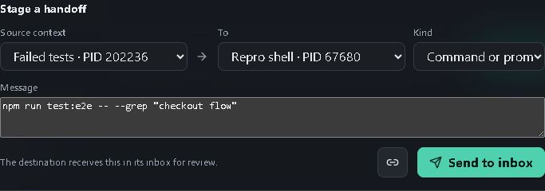

#### Text or summary: pass concise debugging context

Use **Text or summary** when raw logs are too noisy. An API log terminal can tell a debugging shell: `Checkout returns 500 after inventory reservation; request ID req-7f31.` The request ID and failure stage survive as structured context without pasting a whole log stream.

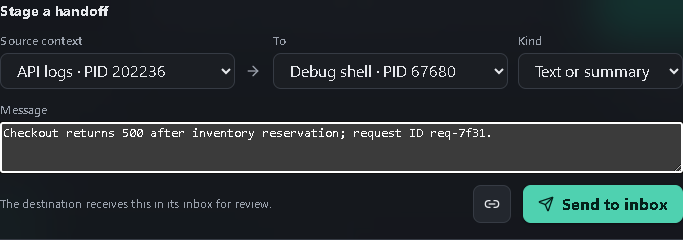

#### File or folder path: point to an artifact

Use **File or folder path** for a trace, coverage report, build output, generated migration, or repository folder. A test runner can hand the investigation shell `D:\shop-app\test-results\checkout-flow\trace.zip` without risking shell metacharacters or accidental execution.

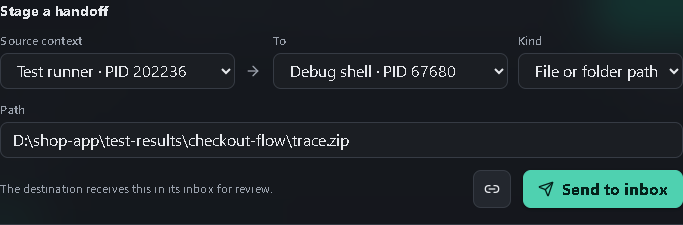

#### Status or readiness: coordinate dependent processes

Use **Status or readiness** when one terminal is waiting on another service. An API terminal can announce `ready` with `API listening on http://localhost:8000; migrations applied.` The frontend developer immediately knows both the endpoint and the prerequisite state.

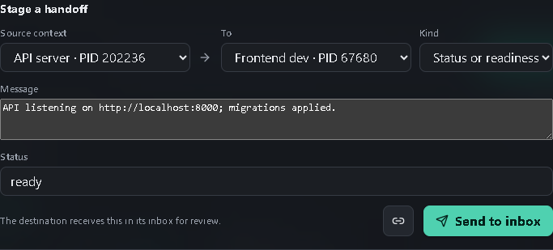

#### Task: delegate bounded work

Use **Task** for a concrete assignment to another developer shell or agent: `Investigate the flaky checkout test. Reproduce first; do not change authentication code.` Including the constraint prevents a broad fix from drifting into security-sensitive code.

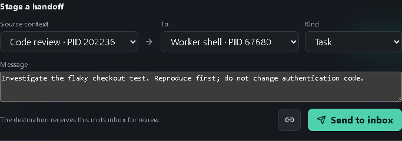

#### Result: return an outcome and changed path

Use **Result** to close the loop. A worker can report `Fixed a stale cart-state race; all 18 checkout tests pass.` and attach `D:\shop-app\src\checkout\cart-store.ts`. The reviewing terminal gets both the conclusion and the file to inspect.

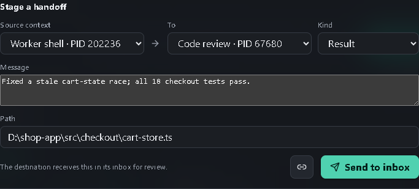

### Receiver review workflow

The receiver sees the source, destination, kind, timestamp, and literal payload together. **Insert** writes into the intended target without Enter; **Dismiss** removes the handoff without touching the terminal. This is the approval boundary that makes a handoff safer than remotely injecting input.

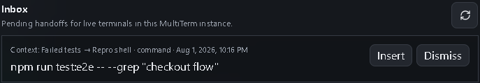

### Terminal connections

Pending handoffs draw a dashed amber circle-to-arrow connector from the selected source context to the target pane. The connector disappears when the handoff is inserted, dismissed, or expires. Multiple pending handoffs on the same route share one connector with a count.

For example, a command handed from **Frontend dev** to **API server** produces a temporary amber route while the API terminal still has an inbox item to review.

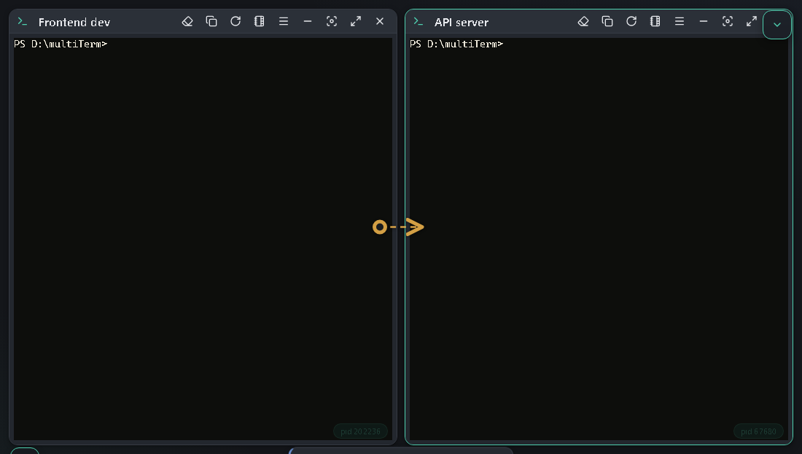

To keep a directional connection visible without sending a message, choose the source and target in **Terminal messages**, then select **Link terminals**. Explicit links use a solid cyan diamond-to-arrow connector. Remove one with **Unlink** in the Connections list. Links persist across reloads in the local browser profile, synchronize to other same-origin MultiTerm windows, and are removed when either terminal session ends. Workspace connectors appear only when both endpoint panes are visible; the dialog topology shows the current routes and provides the management controls.

A useful persistent link is **Frontend dev** to **API server** during feature work: it records the direction in which UI findings, endpoint questions, and reproduction commands normally travel without sending anything by itself.

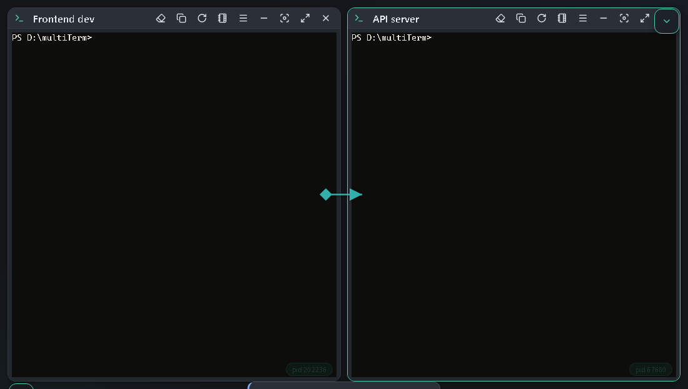

Hover or select a workspace connector to reveal **Send message**. This opens the handoff composer with that connector's source and destination already selected; the message still goes to the receiver's inbox and never executes automatically.

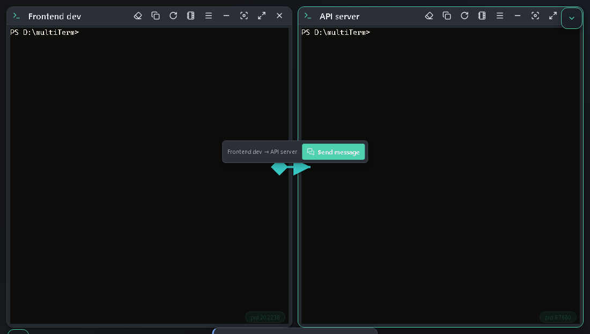

An explicit link is visual metadata only. It does not authenticate either terminal, grant shell access, deliver data, or run commands.

## Search, broadcast, and input

### Search

- <kbd>Ctrl+F</kbd> searches the active terminal.
- <kbd>Ctrl+Shift+F</kbd> searches all terminals.
- The **Search** box in the top bar searches every terminal and hides the panes with nothing to show.
- Use Enter/Shift+Enter to move between matches and Escape to close search.

Select some terminal text, right-click it, and choose **Search all terminals for "…"** to filter the workspace down to the terminals containing that text. The terminal you right-clicked always stays on screen, even when it is the only place the text appears.

#### Matches on other pages

Terminals on other pages are searched too. While **Search across pages** is on (the default), a matching pane from another page is borrowed onto the current stage for the duration of the search and wears a badge naming the page it belongs to; select that badge to open its real page. The find bar reports how many pages the matches span, and its **All pages / This page** control narrows the search to the page you are on. With the scope narrowed, the find bar offers a count of the matches waiting elsewhere and a **Show** action that brings them in. Panes are handed back to their own pages as soon as the search is cleared, and a maximized pane is restored automatically while borrowed results are on screen. The scope also lives in Settings under **Terminal → Search across pages**.

### Broadcast

Press <kbd>Ctrl+Shift+B</kbd> to compose text once and send it to several terminals. Broadcast scope can target the current page or all pages. The **Send Enter** option controls whether the command runs immediately.

### Clipboard behavior

MultiTerm supports copy-on-select, <kbd>Ctrl+C</kbd> or <kbd>Ctrl+Shift+C</kbd> for selected terminal text, <kbd>Ctrl+Shift+V</kbd>, optional <kbd>Ctrl+V</kbd> paste, right-click paste modes, and Copilot CLI clipboard cleanup. To interrupt the current terminal command, keep Ctrl held and press C three times in rapid succession. Copied File Explorer items are pasted as file paths. Images copied from tools such as Snipping Tool are saved temporarily as PNG files and pasted as paths so Copilot CLI can attach them as prompt context. Configure clipboard behaviors in Settings.

Choose **Paste and execute** directly below **Paste** in a terminal's right-click menu to paste clipboard text using terminal paste semantics and then press Enter. The blank-workspace right-click menu offers the same action. If no terminal has keyboard focus, MultiTerm opens one on the current page and runs the clipboard text after its shell is ready.

Choose **Prepare and paste...** to put clipboard text into the same preparation editor described below. Edit or validate it, then choose **Paste** to insert the result back into the terminal whose menu you opened. It uses terminal paste semantics and does not append Enter. Clipboard reading begins only after you choose the action, so opening the right-click menu stays on its fast synchronous path.

### Copy and prepare selected text

Select terminal output, right-click it, and choose **Copy and prepare...** to open the selected text in an editor before it reaches a file, the clipboard, or another terminal.

The editor opens with word wrap enabled and shows synchronized line numbers in its left gutter. Use the wrap toolbar button to keep long lines on screen or switch to horizontal scrolling. Use the eraser action to remove leading, trailing, and horizontal Copilot TUI frame characters (`|`, `│`, `┃`, and box-drawing rules) while preserving pipes inside commands. The editor also supports Tab/Shift+Tab indentation, find and replace, cursor and document statistics, and undo/redo.

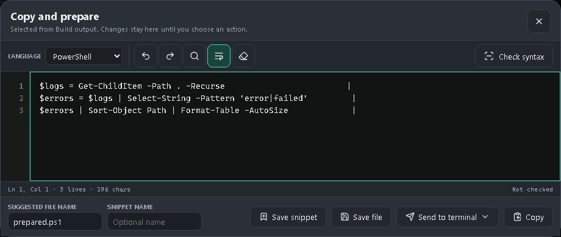

Choose PowerShell, Batch/cmd, C#, or plain text before selecting **Check syntax**. PowerShell uses the real PowerShell AST parser, C# uses the installed Windows C# compiler, and Batch performs non-executing structural checks for parentheses, quotes, and missing labels because `cmd.exe` has no safe parse-only mode. Select an issue location to move the editor cursor there.

After editing, choose one of these actions:

- **Save file** or <kbd>Ctrl+S</kbd> opens Save As with a suggested script extension for the selected language.
- **Save snippet** stores a single prepared command under the name you enter.
- **Send to terminal** opens a searchable list of live destinations and inserts the text using terminal paste semantics without appending Enter. **New terminal** stays at the bottom after a divider and opens one on the current page before inserting the text. In the destination list, Up/Down wraps through results, Home/End jumps to the edges, and Page Up/Page Down moves five results at a time. Hold Alt to temporarily turn the button into **Send to new terminal** and run that action directly.
- **Copy** places the prepared text on the clipboard.

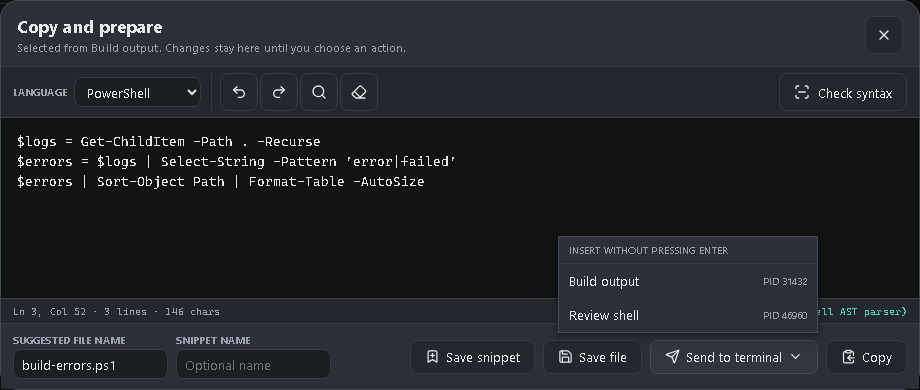

## Statistics and logging

### Statistics

Open **Terminal statistics...** from a pane or **All terminal statistics...** from the workspace context menu. Statistics include session identity, PID, shell, uptime, rows and columns, input/output totals, and process resource information when available.

If an older installed bridge reports `Unsupported message type: statistics`, update MultiTerm so the UI and bridge versions match.

### Interaction analytics

Open **Analytics** in Settings to see today's and all-time keystroke and focus totals plus a breakdown for each current terminal. Analytics persist across reloads and terminal reattachment. Reset clears both aggregate totals and current-terminal records after confirmation.

A keystroke is one physical keyboard event handled by xterm; pasted text, snippets, startup commands, broadcasts, and other automated input do not increase it. Focus time begins with a physical key and accrues while that terminal input keeps keyboard focus and the MultiTerm page is visible in the focused application window. Clicking a shell or Copilot/Claude composer without typing does not count as activity. The timer pauses when focus moves to settings, a dialog, another app, or a hidden tab.

### Logging

Use **Log to file...** from a terminal context menu to capture output. Stop logging from the same menu, then use **Reveal last log** or **Reveal log folder** to locate the file.

The **Logs** button in the status bar shows application and bridge diagnostics from the current launch together with durable records from earlier launches. MultiTerm stores these records as rotating JSONL files under `%LOCALAPPDATA%\MultiTerm\Diagnostics`. **Diagnostics** settings control how many days old JSONL files are retained, the size at which a new JSONL file begins, and the maximum number of durable records loaded into the viewer. A zero retention value keeps JSONL files indefinitely, zero rotation disables size rotation, and zero viewer entries loads every retained record.

**Include Copilot CLI logs** is off by default. When enabled, MultiTerm launches GitHub Copilot sessions with a dedicated log directory below `Diagnostics\Copilot`, follows every such MultiTerm-owned session, and labels each aggregated row with its terminal title and stable terminal ID. Copilot processes launched elsewhere are not included. **Copilot initial tail (KB)** controls how much existing content is loaded from each owned log when aggregation starts; the default is 256 KB per file, while zero ignores existing content and follows only lines written after opt-in. This setting does not affect Claude.

Diagnostic records remove sensitive named fields and strip credentials, query strings, and fragments from URLs, but this is not comprehensive secret detection. Copilot CLI's source files are written by Copilot itself and remain raw. Treat both directories as sensitive local data; the JSONL retention setting does not delete the raw files below `Diagnostics\Copilot`.

## Notifications, tray, and closing

Settings define the default notifications for terminal activity, questions, inactivity, and the terminal bell. To change one terminal, use its **bell** button and set each channel to **Global**, **On**, or **Off**. Global follows Settings; On and Off override that channel only for the selected terminal. **Questions** alerts when an interactive question is detected, including GitHub Copilot ask-user panels and Claude Code multi-step question forms. It works independently of **Highlight input prompts**, and repeated TUI redraws do not repeat the alert until the question is cleared or answered. On mobile, the bell stays beside the terminal title; on narrow desktop panes, the same control is under **More terminal actions**. Per-terminal choices follow restored sessions, duplicated terminals, restarted terminals, and saved workspaces. Browser notification permission may be required.

In the Electron desktop app, closing the window asks whether to:

- keep MultiTerm running in the system tray;
- quit the UI but keep its bridge and terminal sessions running;
- quit and close the bridge; or
- cancel and return to the workspace.

Choosing **Quit & close bridge** warns that all associated terminal sessions and in-progress commands will end. MultiTerm first sends `exit` to each shell. A busy command that does not exit during the grace period receives terminal Ctrl+C, followed by another `exit`; force termination is the last resort. Tray **Quit MultiTerm** opens the same decision instead of bypassing it.

### Optional watchdog

Setup offers the **MultiTerm watchdog** as a recommended optional task. It installs a lightweight per-user background agent that starts when you sign in, monitors every registered MultiTerm bridge, and detects bridges that are unresponsive or have live terminal sessions after their last app window disconnects. After a reconnect grace period, its decision dialog shows the affected bridge and active-session count. **Keep terminals running** is the safe default; **Close bridge and terminals** starts staged graceful shutdown. Keeping the bridge suppresses repeat prompts until a MultiTerm UI reconnects.

The watchdog is a per-user agent rather than a Windows Service because Windows services run in Session 0 and cannot safely display dialogs in the signed-in user's desktop session. It does not require administrator privileges. Its rotating diagnostic log is `%LOCALAPPDATA%\MultiTerm\watchdog.log`.

Windows does not provide one universal `SIGTERM` equivalent for arbitrary applications. For console sessions, MultiTerm uses terminal Ctrl+C (`ETX`, analogous to `SIGINT`) as the cooperative interrupt, together with the shell's `exit` command. On Linux, the graceful termination signal you may remember is usually `SIGTERM`.

## Windows integration

### File Explorer

The installer can add both:

- a classic **Open in MultiTerm** Explorer context-menu command; and
- a modern Windows 11 **Open in MultiTerm** entry.

Explorer integration is optional and unchecked by default. Enable it explicitly on the installer's **Select Additional Tasks** page. Folder, folder-background, and drive invocations are supported. If MultiTerm is already running, Explorer forwards the folder to a live instance.

### Visual Studio Code

The installer can also add MultiTerm commands to Visual Studio Code's Explorer. Right-click a file to open its containing folder, right-click a folder to open that folder, or use **Open Workspace in MultiTerm** from the Explorer when no resource is selected. The command reuses a live MultiTerm instance or starts one if necessary. For a nonstandard installation, set `multiterm.launcherPath` in VS Code.

### Command line

The installer can optionally add MultiTerm's protected installation directory to the system `PATH`. After opening a new shell, run:

```powershell
multiterm
multiterm "C:\src\my-project"
```

Each normal installed, CLI, or taskbar launch requests an independent app instance with its own bridge port, browser profile, state record, and log. Multiple installed instances can therefore run concurrently.

## Settings

Every settings group starts collapsed. Select a group header or its chevron to expand it. The search box remains at the top of the panel while you scroll and filters individual settings by labels, option names, descriptions, placeholders, control names, and related terminology. For example, **tabs** finds **Pages location**, **macros** finds **Snippets**, and **projects** finds **Workspaces** even when the typed word is not visible in the setting label. Multi-word searches may use related terms in any order. Matching groups expand temporarily; clearing the search restores the groups you had open before searching. Select the double chevron beside the search box to clear any filter and expand every group; select it again — it now points up — to collapse them.

On desktop-width windows, drag the settings panel's right edge to resize it horizontally. Focus that edge and use <kbd>Left</kbd> or <kbd>Right</kbd> for 10-pixel steps, hold <kbd>Shift</kbd> for 50-pixel steps, use <kbd>Home</kbd> or <kbd>End</kbd> for the configured limits, or double-click to restore 300 pixels. **Settings panel width** under **Layout** provides the same persisted 240–720 pixel range. When the window is 1040 pixels wide or narrower, Settings stacks above the terminal area and the horizontal resize edge is hidden.

Settings cover:

- app and terminal color themes;
- terminal font, text size, title size, weight, cursor, opacity, and scrollback;
- layouts, settings-panel width, gaps, dimensions, and minimized-terminal scope;
- startup commands and initial terminal count;
- clipboard, right-click, broadcast, and synchronized-input behavior;
- session persistence and restore;
- activity, inactivity, and bell notifications;
- update-check behavior; and
- header and layout-panel visibility.

**Title size** scales terminal-title text from 80% to 150% and defaults to 110%. Choose 100% to restore the original title size.

Changes are stored locally in the app's browser profile. Use **Reset settings** to return to defaults.

## Keyboard shortcuts

Open the keyboard-shortcut catalog from the top bar or with <kbd>Ctrl+/</kbd>. The **Top Bar Actions** section lists every action button in the app header with a default binding. Right-click any of those buttons to change its primary shortcut, add another shortcut, or jump directly to its catalog row. In the catalog, click any key combination to replace it. Hover an action for one second to reveal controls for adding another combination, removing one, or restoring that action's defaults. Global shortcuts are stored with the other settings; terminal right-click menu shortcuts remain a separate customization. The catalog can also be printed or saved as a UTF-8 text reference.

| Shortcut | Action |
| --- | --- |
| <kbd>Ctrl+N</kbd> / <kbd>Ctrl+Shift+T</kbd> | New terminal |
| <kbd>Ctrl+T</kbd> / <kbd>Ctrl+P</kbd> | New page |
| <kbd>Ctrl+Shift+W</kbd> | Close active terminal |
| <kbd>Ctrl+Shift+R</kbd> | Restart active terminal |
| <kbd>Ctrl+Shift+X</kbd> | Maximize or restore active pane |
| <kbd>F1</kbd> | In-app help |
| <kbd>Ctrl+Shift+P</kbd> | Command palette |
| <kbd>Ctrl+Shift+Q</kbd> | Dequeue next command |
| <kbd>Alt+Q</kbd> | Quick terminal switcher |
| <kbd>Ctrl+F</kbd> | Find in active terminal |
| <kbd>Ctrl+F</kbd> while Help is open | Find in Help |
| <kbd>Ctrl+Shift+F</kbd> | Find in all terminals |
| <kbd>Ctrl+Shift+B</kbd> | Broadcast command |
| <kbd>F11</kbd> / <kbd>Esc</kbd> | Enter fullscreen focus mode / exit and restore the previous UI |
| <kbd>Ctrl+C</kbd> / <kbd>Ctrl+Shift+C</kbd> | Copy |
| <kbd>Ctrl+Shift+V</kbd> | Paste |
| <kbd>Ctrl+Shift+L</kbd> | Clear active terminal |
| <kbd>Ctrl+PageUp</kbd> / <kbd>Ctrl+PageDown</kbd> | Previous or next page |
| <kbd>Ctrl++</kbd> / <kbd>Ctrl+-</kbd> | Change default terminal font size |
| <kbd>Ctrl+Alt++</kbd> / <kbd>Ctrl+Alt+-</kbd> / <kbd>Ctrl+Alt+0</kbd> | Change or reset active-pane zoom |
| <kbd>Ctrl+/</kbd> | Categorized keyboard-shortcut reference |
| <kbd>Escape</kbd> | Close the active dialog, menu, or search |

## Updates and version information

Open **About MultiTerm** from the header or command palette to see the running version, check for updates, open the latest release, or download the current installer. Automatic checks use the configured interval and never install an update without confirmation. Your update-check choice and interval are stored per user, survive upgrades, and are shared by concurrent MultiTerm instances; change them at any time in **Session settings**.

## Troubleshooting

### A terminal does not start

- Confirm the selected shell is installed and available.
- For PowerShell 7, verify `pwsh` runs from a normal terminal.
- For WSL, run `wsl --status` and confirm a distribution is installed.
- Try another working directory; inaccessible paths are rejected.
- Check **Logs** for the bridge error.

### The app disconnected

The UI reconnects automatically when the local bridge restarts. If it remains disconnected, reopen MultiTerm and inspect **Logs**. Source launches use the configured local bridge port; installed concurrent launches automatically claim available fallback ports.

### Explorer or `multiterm` is missing

Run the installer again and select the corresponding optional task. Explorer integration is intentionally opt-in. PATH changes are visible only to shells opened after installation.

### Layout or display problems

Use **Fit all terminals**, then **Reset layout**. If a manual layout is off-screen after a monitor change, switching to another layout and back also normalizes pane positions.

### Getting more detail

Open **Logs** from the status bar and choose the appropriate severity. Include the MultiTerm version, shell type, and relevant log messages when reporting an issue.

## Privacy and security

MultiTerm serves its UI and terminal bridge on loopback only. Browser clients must pass exact Host and Origin checks; remote-mode flags and non-loopback bind hosts are refused. Notes, queues, settings, and workspace metadata are stored locally. Terminal commands and output are not sent to a remote MultiTerm service.

Electron opens only HTTPS external links. Updates must match the GitHub release asset's exact size and SHA-256 digest before launch; the maximum installer size is configurable under **Performance**. Installers are not yet Authenticode-signed, so verify the release source before approving an update.

Treat copied commands, scripts, Administrator terminals, Explorer extensions, and third-party CLIs with the same care you would use in a standalone terminal.

## More information

- [Project README](https://github.com/andrewtheart/multiterm-workbench#readme)
- [Latest release](https://github.com/andrewtheart/multiterm-workbench/releases/latest)
- [Issue tracker](https://github.com/andrewtheart/multiterm-workbench/issues)
- [GNU General Public License v3.0](https://www.gnu.org/licenses/gpl-3.0.html)
