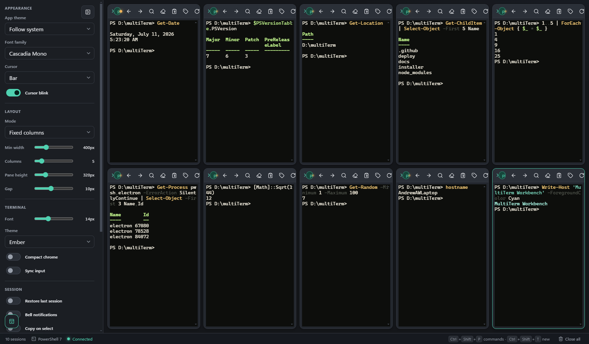

# MultiTerm Workbench

A local xterm.js workbench for running multiple PowerShell sessions from one browser page.



## Requirements

- **Windows 10 version 1809 (build 17763) or newer**, or Windows 11. This is the
  minimum required for the pseudo-terminal support (the ConPTY
  `CreatePseudoConsole` APIs) that MultiTerm uses to run each PowerShell session.
  The Windows installer enforces this and refuses to install on older builds.
- **Windows PowerShell 5.1** (built into Windows 10/11) is enough for the
  self-contained bridge and the installer. **PowerShell 7 (`pwsh.exe`)** is used
  automatically when it's installed, otherwise sessions fall back to Windows
  PowerShell.
- **Node.js** is only needed for the Electron desktop app (`npm start`) and the
  development Node bridge (`npm run server`) — not for `Start-MultiTerm.ps1` or
  the installed build.

## Run

### Desktop app (Electron)

Runs in its own native window — no browser, no address bar:

```powershell
npm install
npm start
```

`npm start` launches the Electron shell, which starts the local bridge under your
system Node runtime and loads the UI in a dedicated window.

> Requires Node.js on your PATH (the terminal bridge uses the native `node-pty`
> module built for your installed Node version).

### PowerShell-only bridge (browser)

No Node install required:

```powershell
.\Start-MultiTerm.ps1
```

The bridge opens your default browser automatically. If it does not, open the URL printed by the bridge, usually:

```text
http://127.0.0.1:3177
```

To start the bridge without opening a browser:

```powershell
.\Start-MultiTerm.ps1 -NoBrowser
```

Node bridge only (no window), useful during development:

```powershell
npm install
npm run server
```

Open the URL printed by the bridge, usually:

```text
http://127.0.0.1:3177
```

## Windows installer

An [Inno Setup](https://www.innosetup.com/) script packages the self-contained
PowerShell bridge (no Node.js runtime required) into a Windows installer. It
installs `Start-MultiTerm.ps1`, the `public/` assets, and Start Menu / optional
desktop shortcuts that launch the bridge and open it in your browser.

Build the installer (requires Inno Setup 6):

```powershell
& "C:\Program Files (x86)\Inno Setup 6\ISCC.exe" installer\MultiTerm.iss
```

The resulting `installer\Output\MultiTerm-Setup-<version>.exe` performs a
per-user install by default (no UAC prompt); users may elect a machine-wide
install from the setup dialog.

A single installer covers **x86, x64, and ARM64** — no separate per-architecture
builds are needed. The payload is architecture-neutral (a PowerShell script plus
web assets, with no native binaries), the setup runs on every architecture, and
it installs into 64-bit `Program Files` on x64/ARM64 and 32-bit `Program Files`
on x86.

## Notes

- The UI is a single-page app in `public/`.
- Browser-only HTML cannot start or stream from local PowerShell processes. `Start-MultiTerm.ps1` and `server.js` are local-only bridges that serve the page, accept WebSocket input, and own PTY-backed PowerShell child processes through Windows ConPTY.
- The bridge binds to `127.0.0.1` by default. Set `PORT=4000` to choose another port.
- Sessions default to PowerShell 7 (`pwsh.exe`) and can also use Windows PowerShell.
- Ctrl+C, Tab completion, PSReadLine editing, and terminal resize are forwarded through the pseudo-terminal rather than plain pipes.
- The top search box filters terminal panes by contained terminal text; non-matching panes stay hidden until matching output appears or the search is cleared.
- Layout modes include auto fit, fixed columns, fixed rows, horizontal strip, vertical stack, focus rail, and manual canvas.
- The bottom-left workspace buttons hide or restore the top header and layout sidecar for more terminal space.
- The bottom-left trash button closes every terminal pane and tells the bridge to kill all running PowerShell sessions.
- Drag a terminal by its header to the top, bottom, left, or right edge of the workbench to snap it there; the other terminals reflow into the remaining space.
- Manual canvas panes can be dragged by their header and resized from the lower-right corner.
- Any pane can be minimized to a chip in the status bar with its header's minimize (−) button; click the chip to restore the pane in place.
- The chevron in the bottom-right corner opens a live **log console** that tails everything the app and bridge do (connections, session start/exit, broadcasts, workspace changes, and errors). Logs can be filtered by level, copied, or cleared; a badge on the chevron flags new errors while it is closed. The bridge also prints these events to its console window.