<h1 align="center">
  
  &nbsp;MultiTerm Workbench
</h1>

A Windows terminal workspace for people who run many shells at once — PowerShell,
Command Prompt, and WSL together, with broadcast input, cross-terminal search, and
layouts from auto-fit grids to a free-form canvas.

**⬇️ [Download the latest MultiTerm Workbench installer](https://github.com/andrewtheart/multiterm-workbench/releases/latest)** — or browse all [releases](https://github.com/andrewtheart/multiterm-workbench/releases).

<p align="center">
  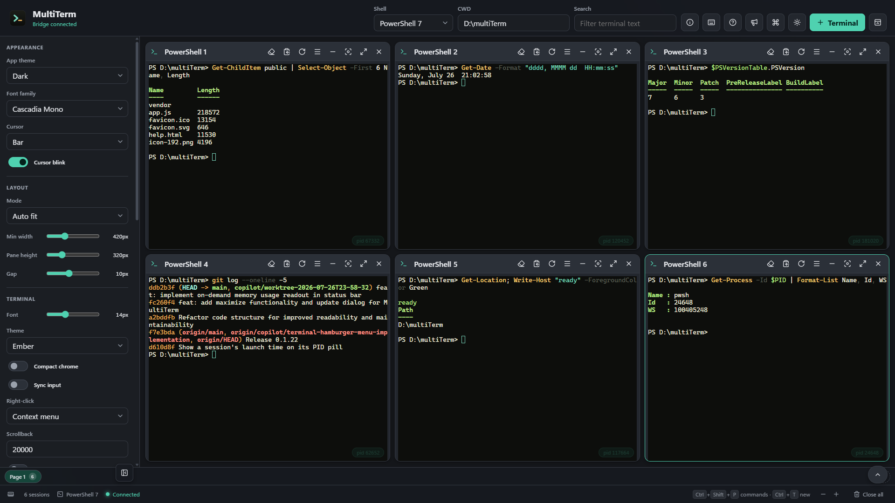
</p>

## Why MultiTerm?

<table>
  <tr>
    <td align="center" width="33%">
      <h3>🖥️ Multi-pane shell workspace</h3>
      Run PowerShell, Command Prompt, and WSL terminals in one view with real PTY behavior, prompt editing, Ctrl+C, and resize handling.
    </td>
    <td align="center" width="33%">
      <h3>⛶ Real maximize + focus rail</h3>
      Maximize one pane to fill the terminal stage, or use focus rail to keep one primary pane large while others stay visible.
    </td>
    <td align="center" width="33%">
      <h3>🧩 Many layout modes</h3>
      Switch between auto fit, fixed rows/columns, strips, carousels, priority/compact grids, four master edges, spotlight, bento, and manual canvas.
    </td>
  </tr>
  <tr>
    <td align="center" width="33%">
      <h3>🧲 Drag-to-snap and manual canvas</h3>
      Drag panes to top, bottom, left, or right snap zones, or place and resize panes freely in manual mode.
    </td>
    <td align="center" width="33%">
      <h3>📣 Broadcast + sync input</h3>
      Send one command to all terminals (or a scope), and optionally mirror keyboard input across every pane.
    </td>
    <td align="center" width="33%">
      <h3>🔎 Find in one pane or all panes</h3>
      Search inside the active terminal or run a global find across every visible terminal output.
    </td>
  </tr>
  <tr>
    <td align="center" width="33%">
      <h3>📝 PID-bound notes and command queues</h3>
      Keep context beside each terminal process, stage commands for manual insertion, or use a pane's translucent plus button to run queued shell commands and AI assistant prompts automatically after a confirmed ready state. When a process exits, its notes move to Recovered notes and its queued commands remain reusable.
    </td>
    <td align="center" width="33%">
      <h3>⌨️ Command palette + quick switch</h3>
      Use keyboard-first command discovery and fast terminal switching without leaving the workbench.
    </td>
    <td align="center" width="33%">
      <h3>🗂️ Snippets and workspaces</h3>
      Save reusable commands and named workspace layouts, then restore sessions quickly when you return.
    </td>
  </tr>
  <tr>
    <td align="center" width="33%">
      <h3>⬆️ Built-in updater</h3>
      Opt in to update checks once, choose a recurring interval that survives upgrades and concurrent instances, read release notes in-app, and launch the newest installer directly from the update dialog.
    </td>
    <td align="center" width="33%">
      <h3>📜 Live diagnostics log console</h3>
      Tail app and bridge logs in real time, filter levels, copy output, and catch reconnect/session lifecycle issues quickly.
    </td>
    <td align="center" width="33%">
      <h3>🧠 On-demand memory readout</h3>
      Hover the memory chip in the status bar for live app + system RAM usage, refreshed only while the chip is open.
    </td>
  </tr>
  <tr>
    <td align="center" width="33%">
      <h3>📊 Per-terminal bridge and process statistics</h3>
      Right-click a terminal for bridge traffic, CPU, and memory, or open Analytics for persistent physical-keystroke and focused-time totals with a live per-terminal breakdown.
    </td>
    <td align="center" width="33%">
      <h3>🔗 Attach running WSL tmux sessions</h3>
      Discover tmux servers across installed WSL distributions and connect an existing session as another live MultiTerm client without restarting its shell or changing its current work.
    </td>
    <td align="center" width="33%">
      <h3>🧹 Copy and prepare selected text</h3>
      Open selected or clipboard text in a syntax-aware editor with line numbers and word wrap, clean Copilot TUI borders, save it as a script or snippet, or paste the prepared text into a live terminal without pressing Enter.
    </td>
  </tr>
  <tr>
    <td align="center" width="33%">
      <h3>🔒 Locked down by default</h3>
      Both bridges refuse non-loopback binds and enforce exact <code>Origin</code> and <code>Host</code> checks. Electron runs the renderer sandboxed with no Node access, elevated relays use one-time authentication, and updates require HTTPS plus exact size and SHA-256 verification before launch.
    </td>
    <td align="center" width="33%">
      <h3>🖱️ Deep right-click context menu</h3>
      Copy, paste, prepare and paste, paste and execute, prepare selected text in a syntax-aware editor, find, maximize, terminal statistics, notes, a command-queue submenu that inserts a staged command on click, configured Copilot or Claude launch and local-session resume, run scripts, log to file, Git status, top processes, custom commands, split/duplicate, restart, cycle colour, and move to a new page — all one right-click away. Drag actions or whole sections, rename, add, or remove sections, and hide actions you do not use.
    </td>
    <td align="center" width="33%">
      <h3>🔔 Activity and input alerts</h3>
      Highlight terminals waiting for input and independently alert on Copilot or Claude question forms, background activity, silence, or the terminal bell, with global defaults and per-terminal overrides.
    </td>
  </tr>
  <tr>
    <td align="center" width="33%">
      <h3>↔️ Terminal messaging and routes</h3>
      Hand commands, summaries, paths, tasks, and results to another live terminal through a bridge-owned inbox. Receivers explicitly insert or dismiss each item, while persistent directional links and workspace connectors keep recurring workflows visible.
    </td>
    <td align="center" width="33%">
      <h3>⏱️ Automation Studio</h3>
      Build interval, daily, or weekday schedules with ordered actions that run or stage only after the target shell, Copilot, or Claude prompt is confirmed ready. Review history, pause globally, and route completed assistant handoffs to connected terminals.
    </td>
    <td align="center" width="33%">
      <h3>🧩 Explorer and editor integrations</h3>
      Opt into Windows 11 File Explorer, Visual Studio Code, or Visual Studio 2022/2026 integrations during setup. Open selected folders, files, projects, and solutions directly in a live MultiTerm instance, with clean upgrade and uninstall ownership.
    </td>
  </tr>
</table>

### Attaching an existing terminal

Click the link button beside **Terminal**, or run **Attach WSL tmux session…** from the command
palette. MultiTerm scans each WSL distribution for running tmux sessions and shows the distro,
session name, window count, active pane PID/command, and whether another client is already attached.
Selecting one starts a real `tmux attach-session` client in a MultiTerm pane. Closing the pane detaches
that client; the tmux server and its programs keep running.

Windows does not provide a supported way to move an already-running Command Prompt, PowerShell,
Windows Terminal, or ordinary WSL process into a new ConPTY host. ConPTY's communication channels
must be established before the hosted process is created. For a shell that may need later attachment,
start it inside tmux first (for example, run `tmux new -s work` inside WSL).

## Testing

The default test command runs the iterative suite: all unit/integration tests and
all browser tests that do not open native Windows UI.

```powershell
npm test
```

For browser tests only, `npm run test:e2e` is also iterative and excludes tests
tagged `@full`. Use the full suite only when native interaction is acceptable:

```powershell
npm run test:full
```

Run the dedicated Electron-shell regression separately when changing preload,
IPC, native clipboard, or other desktop-only behavior:

```powershell
npm run test:electron
```

The full suite includes UAC/elevated-process scenarios and the native script
browser, and enforces 100% backend and renderer coverage. It may display UAC and
file-selection prompts on an interactive Windows desktop.

## Screenshot tour

<table>
  <tr>
    <td align="center" width="50%">
      
      <br><strong>Grid workbench:</strong> titled shell tasks and completed Copilot sessions in one six-pane view.
    </td>
    <td align="center" width="50%">
      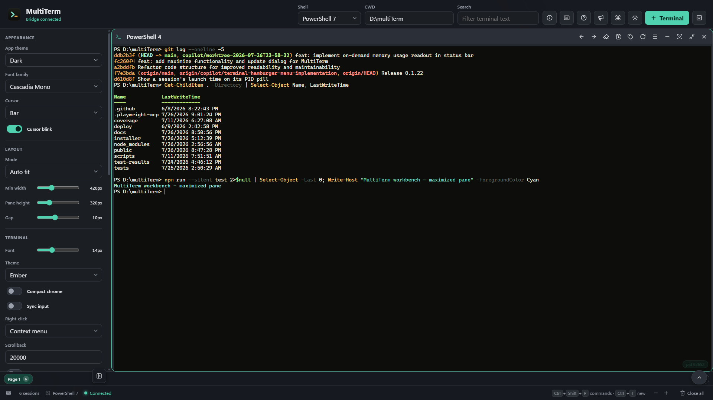
      <br><strong>Real maximize:</strong> one pane overlays the full terminal stage.
    </td>
  </tr>
  <tr>
    <td align="center" width="50%">
      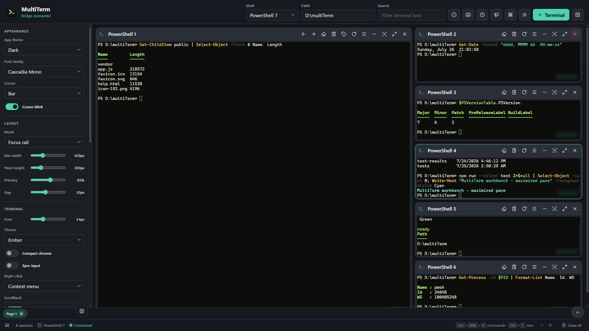
      <br><strong>Focus rail:</strong> keep one large primary pane while others remain docked.
    </td>
    <td align="center" width="50%">
      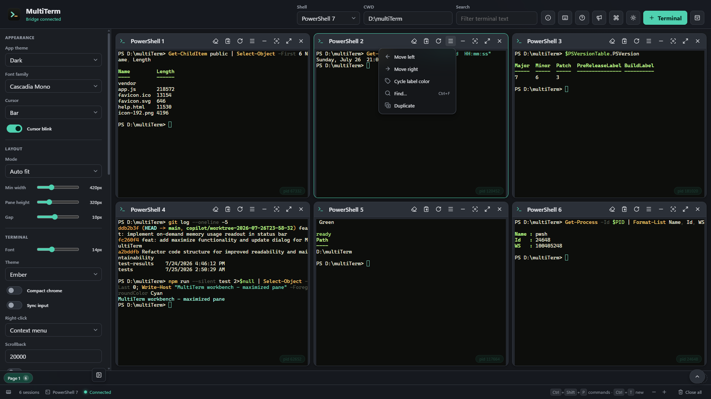
      <br><strong>Pane hamburger menu:</strong> Find and Duplicate are always available.
    </td>
  </tr>
  <tr>
    <td align="center" width="50%">
      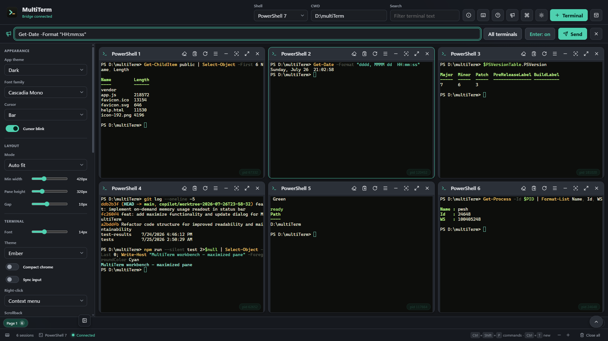
      <br><strong>Broadcast bar:</strong> send one command to all terminals or a selected scope.
    </td>
    <td align="center" width="50%">
      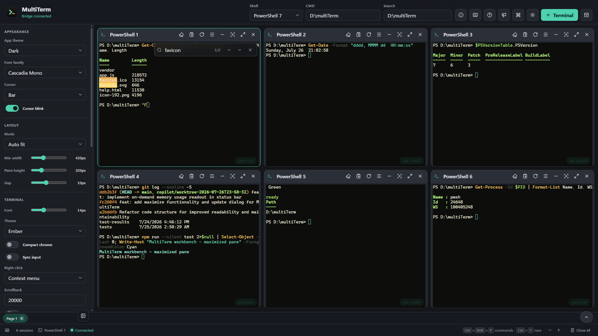
      <br><strong>Find &amp; filter:</strong> per-pane search with match highlighting, plus a header search that highlights and hides non-matching panes live.
    </td>
  </tr>
  <tr>
    <td align="center" width="50%">
      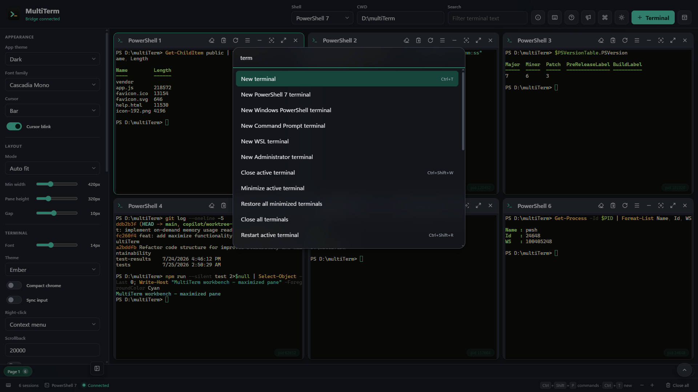
      <br><strong>Command palette:</strong> keyboard-first command discovery and execution.
    </td>
    <td align="center" width="50%">
      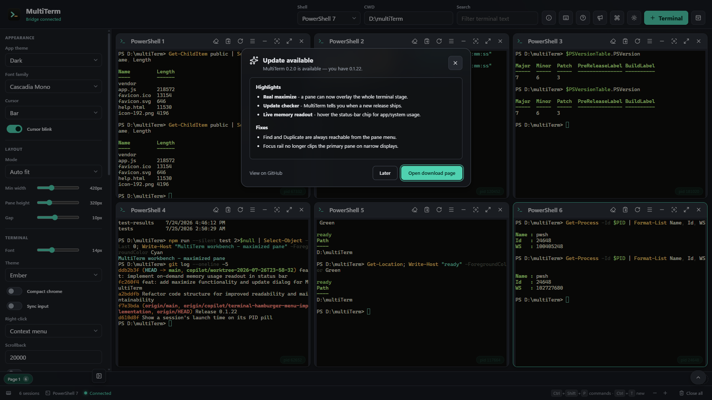
      <br><strong>Updater dialog:</strong> release notes plus one-click download/install flow.
    </td>
  </tr>
  <tr>
    <td align="center" width="50%">
      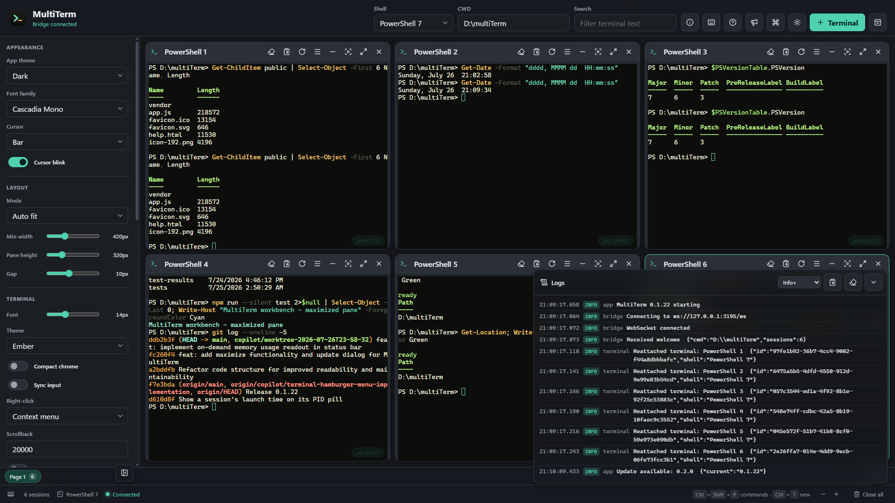
      <br><strong>Log console:</strong> live diagnostics with level filters and quick export.
    </td>
    <td align="center" width="50%">
      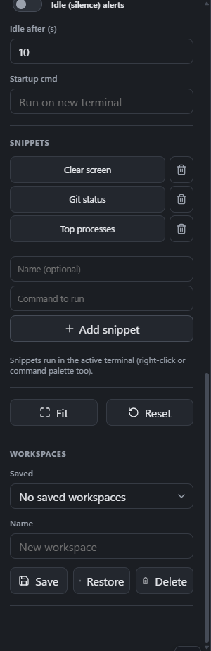
      <br><strong>Snippets + workspaces:</strong> reusable commands and saved layouts.
    </td>
  </tr>
  <tr>
    <td align="center" width="50%">
      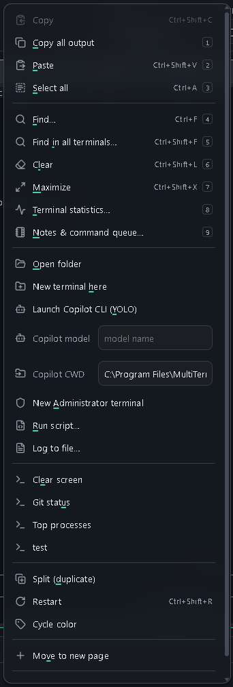
      <br><strong>Deep context menu:</strong> searchable, customizable action groups on a translucent terminal-aware surface.
    </td>
    <td align="center" width="50%">
      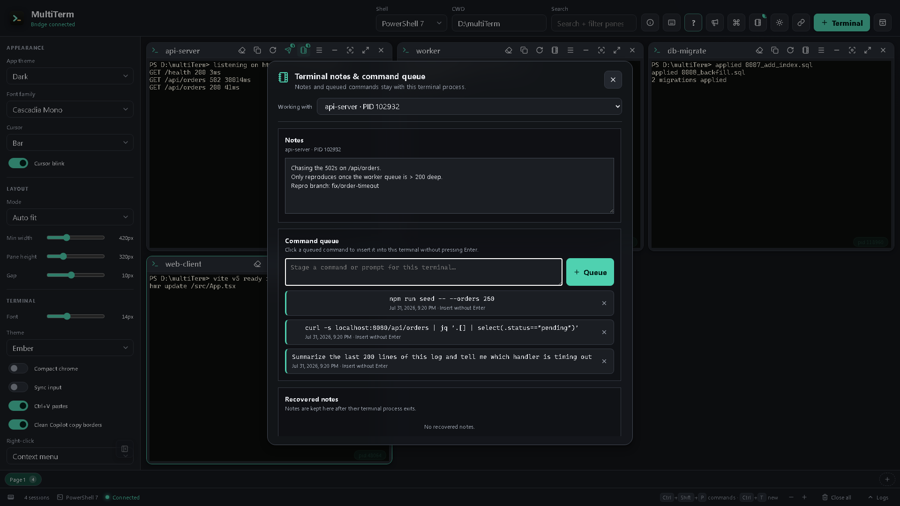
      <br><strong>Notes + command queues:</strong> process-bound context and reusable staged commands.
    </td>
  </tr>
  <tr>
    <td align="center" width="100%" colspan="2">
      
      <br><strong>Status memory chip:</strong> hover to show live app/system memory usage.
    </td>
  </tr>
</table>

## Performance

MultiTerm is built to stay smooth with many live shells open at once. The work
below is why a wall of panes streaming output still feels responsive.

### GPU-accelerated rendering (WebGL)

Each terminal renders through xterm's **WebGL addon**, which draws the grid on the
GPU instead of the DOM — far faster under heavy output. The catch is that Chromium
force-loses the *oldest* WebGL context once ~16 are live, and this xterm build's
WebGL addon does **not** fall back to the DOM renderer when its context dies, so an
evicted pane would go blank while its buffer still held the text. Past ~16 panes
that turned into a rolling eviction cascade (every recovered pane evicted another),
which showed up as white, flickering panes.

So MultiTerm hands out a **bounded budget** of GPU contexts (`WEBGL_MAX_CONTEXTS = 12`).
Panes beyond the budget simply keep xterm's DOM renderer — slower under heavy
output but always correct — instead of fighting over contexts. The budget sits
below Chromium's stock cap so it holds even in a plain browser tab, and both
launchers additionally raise the ceiling with `--max-active-webgl-contexts=64` so
terminal renderers never compete with the app's other canvases. Measured with 19
panes open: **before**, 16 live contexts / 3 lost / panes blank; **after**, 12
renderers / 0 lost / 0 blank.

### Automatic GPU context-loss recovery

If a context is genuinely lost (GPU reset, driver hiccup), the pane's renderer is
recreated shortly after — normally ~300 ms, backing off to ~1.5 s if losses keep
recurring in a short window — so a pane resumes drawing instead of staying frozen
or blank.

### Coalesced output — one write per frame

Live shell output can arrive as hundreds of tiny WebSocket messages per second.
Rather than paying the full write pipeline (xterm write + search bookkeeping +
activity/prompt/notification scheduling + scroll) for every message, incoming
chunks are queued and drained **once per animation frame**. That collapses N
messages per frame into a single `term.write` and a single side-effect pass,
keeping the UI responsive during noisy builds and log tails.

### Coalesced fits and smarter resizing

- **One fit per frame.** A single layout change can fire the `ResizeObserver`
  (which watches both the pane and its screen) more than once; those are coalesced
  into a single visual fit per animation frame.
- **Deferred PTY resize during window drags.** Dragging the window fires the
  observer dozens of times per second. The cheap visual fit still runs so panes
  track the layout smoothly, but the actual PTY resize (WINCH) is held back and a
  single settled size is forwarded once motion stops. The shell (PSReadLine) then
  repaints its prompt exactly **once**, at the final width, instead of dozens of
  times per second.
- **Duplicate-resize dedupe.** Identical dimensions are never sent to the bridge
  twice, so redundant resize traffic never reaches the shell.

### Faster startup

- **No Electron menu build.** The default application menu is disabled *before*
  the app is ready, so Electron never spends time constructing a menu the
  menu-less tool doesn't use.
- **Defer non-visual work to idle.** Cosmetic and on-demand setup (click ripples,
  the diagnostics log console binding) is deferred to a `requestIdleCallback`
  window so it never competes with first paint, the bridge connection, or early
  input. The first terminal becomes interactive sooner.

### Cheaper background work

- **On-demand memory readout.** The status-bar memory reading is genuinely
  expensive (each sample spawns a ~1 s PowerShell CIM query), so it runs **only
  while you're hovering the memory chip** rather than on an always-on timer. A
  burst of hovers coalesces into a single in-flight query instead of one
  PowerShell process per request. (Set `MEMSTATS=1` to opt back into the old
  always-on 10-second broadcast.)
- **On-demand terminal statistics.** Process-tree CPU and memory are sampled
  only when the statistics dialog opens or its Refresh button is clicked.
  Keystroke and UTF-8 bridge-payload byte counters are maintained in-process,
  so they add negligible overhead while terminals are running.
- **Bounded scrollback.** Scrollback defaults to 20,000 lines (configurable, up to
  1,000,000) to keep per-pane memory in check while still holding plenty of
  history.
- **Reflow-safe control clicks.** Activating a pane can reflow the whole layout
  (e.g. focus-rail and master layouts promote the active pane). Re-activation is
  skipped for clicks on pane controls so the layout doesn't shift the button out
  from under the cursor mid-click — avoiding a wasted reflow and a missed click.

## Architecture

MultiTerm is a two-part system: a **front-end single-page app** (xterm.js in
`public/`) and a **local-only bridge** process that actually owns the PowerShell
sessions. This split exists because browser JavaScript cannot spawn or stream from
local processes — so the bridge serves the page, accepts input over a WebSocket,
and drives PTY-backed shells through Windows **ConPTY**.

### Component topology

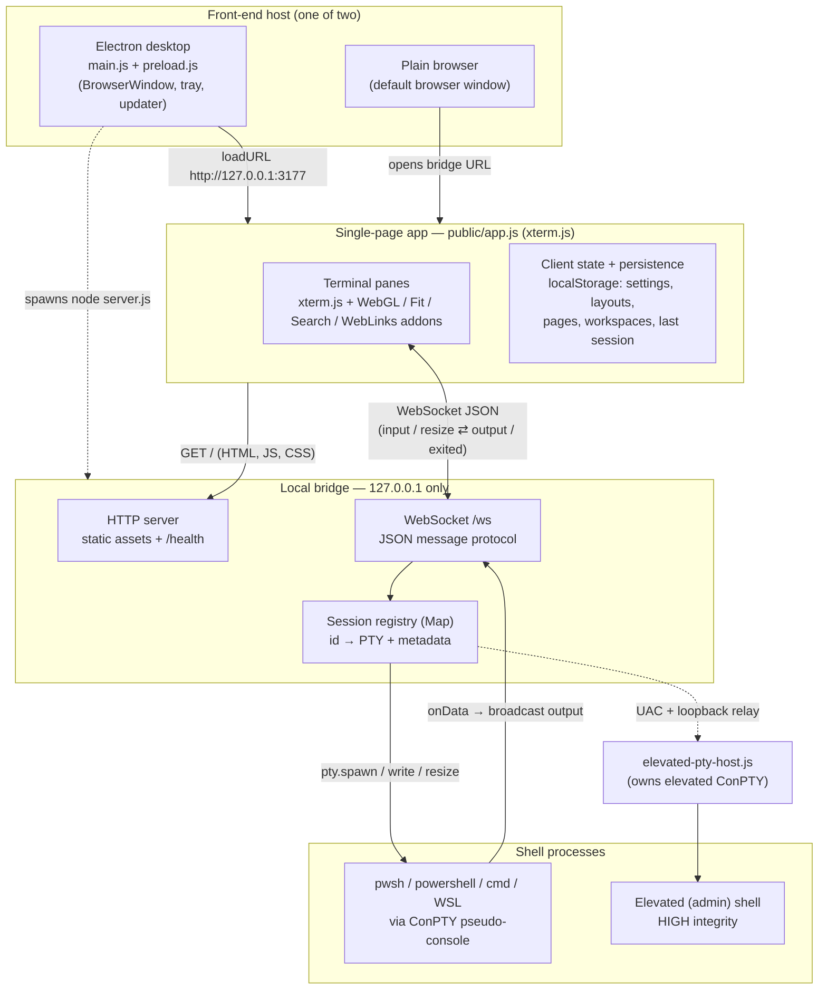
```mermaid
flowchart TB
    subgraph host["Front-end host (one of two)"]
        electron["Electron desktop<br/>main.js + preload.js<br/>(BrowserWindow, tray, updater)"]
        browser["Plain browser<br/>(default browser window)"]
    end

    subgraph spa["Single-page app — public/app.js (xterm.js)"]
        panes["Terminal panes<br/>xterm.js + WebGL / Fit / Search / WebLinks addons"]
        clientstate["Client state + persistence<br/>localStorage: settings, layouts,<br/>pages, workspaces, last session"]
    end

    subgraph bridge["Local bridge — 127.0.0.1 only"]
        direction TB
        httpsrv["HTTP server<br/>static assets + /health"]
        wssrv["WebSocket /ws<br/>JSON message protocol"]
        sessions["Session registry (Map)<br/>id → PTY + metadata"]
    end

    subgraph shells["Shell processes"]
        pty1["pwsh / powershell / cmd / WSL<br/>via ConPTY pseudo-console"]
        elev["Elevated (admin) shell<br/>HIGH integrity"]
    end

    electron -->|"loadURL http://127.0.0.1:3177"| spa
    browser -->|"opens bridge URL"| spa
    electron -.->|"spawns node server.js"| bridge

    panes <-->|"WebSocket JSON<br/>(input / resize ⇄ output / exited)"| wssrv
    spa -->|"GET / (HTML, JS, CSS)"| httpsrv
    wssrv --> sessions
    sessions -->|"pty.spawn / write / resize"| pty1
    pty1 -->|"onData → broadcast output"| wssrv

    sessions -.->|"UAC + loopback relay"| elevhost["elevated-pty-host.js<br/>(owns elevated ConPTY)"]
    elevhost --> elev
```

### The two interchangeable bridges

The front-end speaks the same protocol to either bridge, so they are drop-in
alternatives:

| Bridge | File | PTY backend | Needs Node? | Launched by |
| --- | --- | --- | --- | --- |
| **Node bridge** | `server.js` | native `node-pty` (`@homebridge/node-pty-prebuilt-multiarch`) over ConPTY | Yes | Electron (`main.js` spawns `node server.js`) or `npm run server` |
| **PowerShell bridge** | `Start-MultiTerm.ps1` | embedded C# calling ConPTY directly | No | `Start-MultiTerm.ps1` / the installer, opens your browser |

Both serve the identical `public/` assets, expose the same HTTP + WebSocket
surface, and bind to `127.0.0.1` only (remote access is off unless explicitly
enabled). The Node bridge even hand-rolls its own RFC 6455 frame encode/decode so
it has **zero runtime dependencies beyond `node-pty`**.

### Session data flow

Each terminal pane maps to one PTY-backed shell in the bridge's session registry.
Input and output are decoupled: input is a targeted write, while output is
**broadcast to every connected client**, so multiple windows/tabs stay in sync and
sessions outlive any single page.

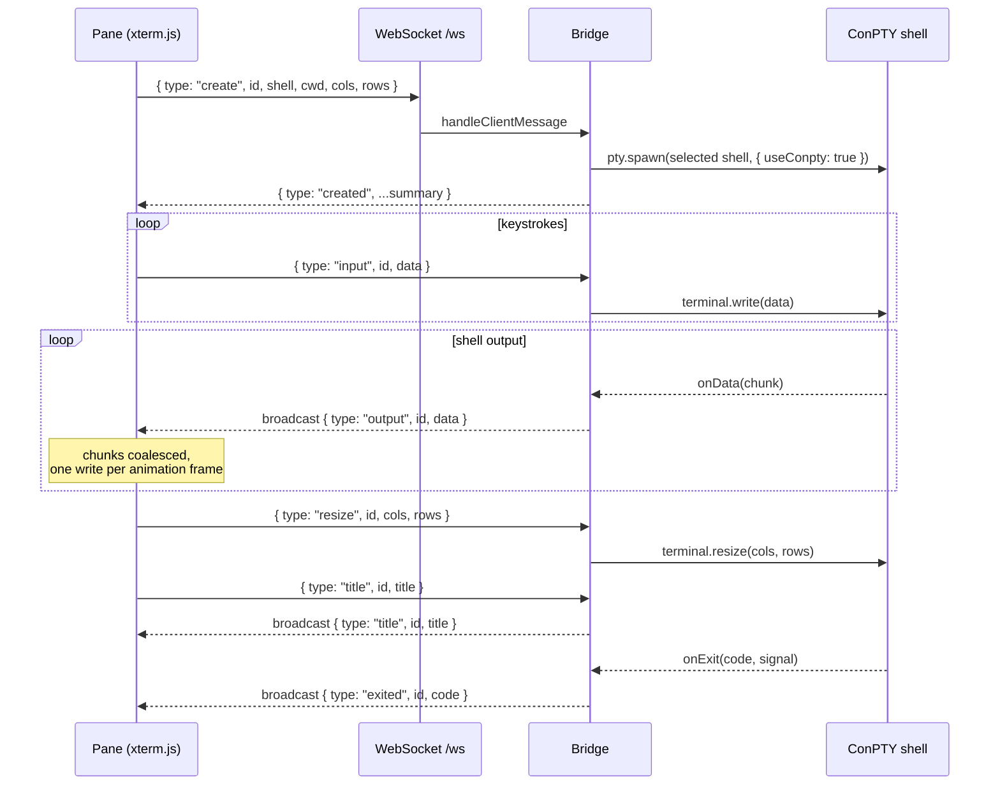
```mermaid
sequenceDiagram
    participant UI as Pane (xterm.js)
    participant WS as WebSocket /ws
    participant BR as Bridge
    participant PTY as ConPTY shell

    UI->>WS: { type: "create", id, shell, cwd, cols, rows }
    WS->>BR: handleClientMessage
    BR->>PTY: pty.spawn(selected shell, { useConpty: true })
    BR-->>UI: { type: "created", ...summary }

    loop keystrokes
        UI->>BR: { type: "input", id, data }
        BR->>PTY: terminal.write(data)
    end

    loop shell output
        PTY-->>BR: onData(chunk)
        BR-->>UI: broadcast { type: "output", id, data }
        Note over UI: chunks coalesced,<br/>one write per animation frame
    end

    UI->>BR: { type: "resize", id, cols, rows }
    BR->>PTY: terminal.resize(cols, rows)

    UI->>BR: { type: "title", id, title }
    BR-->>UI: broadcast { type: "title", id, title }

    PTY-->>BR: onExit(code, signal)
    BR-->>UI: broadcast { type: "exited", id, code }
```

**Client → bridge** messages: `create`, `listTmux`, `input`, `resize`, `title`, `kill`, `killAll`,
`logStart` / `logStop`, `reveal`, `openPath`, `pickScript`, `elevate`, `list`,
`memstats`, `statistics`, `communicationConfig`, `messageSend`, `messageList`, and
`messageAction`. **Bridge → client** messages: `welcome` (session catalog
on connect), `created`, `output`, `title`, `exited`, `createFailed`, `sessions`,
`memstats`, `statistics`, terminal-message events/results, and `error`. On reconnect the bridge re-announces the sessions it kept alive via
`welcome`, and the front-end re-adopts each pane instead of respawning it. Title
changes are stored in the bridge and broadcast so the control console and every
connected renderer stay aligned.

> **Both bridges must stay in lock-step.** Every client → bridge message type is
> implemented independently in `server.js` (Node) and the embedded C# of
> `Start-MultiTerm.ps1` (PowerShell). Adding or changing a message means editing
> both, or the bridge that lags behind answers `error: "Unsupported message type"`.

### Front-end (single-page app)

`public/app.js` owns all UI state in a single `state` object and renders each pane
with an xterm.js `Terminal` plus the Fit, WebGL, Search, and WebLinks addons.
User preferences and layout survive restarts through `localStorage` (settings,
manual layouts, pages, per-terminal page assignment, workspaces, last session,
pane order, PID-bound notes, recovered notes, and live/unparented command queues).
A WebSocket client with **exponential-backoff auto-reconnect** keeps
the UI attached to the bridge; the rendering hot paths (coalesced output, coalesced
fits, deferred resize) are described in [Performance](#performance) above.

### Electron desktop shell

In desktop mode, `main.js` spawns the Node bridge as a child process, waits for
`/health`, then points a `BrowserWindow` at `http://127.0.0.1:3177/`. `preload.js`
exposes a tiny, isolated `window.multiterm` IPC surface for the few things a page
can't do itself: native script picker, tray/close handling, the GitHub-release
updater, and relaunching the whole app elevated. The bridge is also **supervised**
— if it dies unexpectedly it is respawned, with a crash-loop guard that surfaces an
error instead of restarting forever.

### Administrator terminals

A UAC-elevated shell runs at **HIGH integrity**, which the medium-integrity bridge
cannot attach a ConPTY across. So the bridge binds a loopback port, launches
`elevated-pty-host.js` via UAC, and that helper owns the elevated shell's
pseudo-console on the high side of the boundary and relays terminal frames back
over the loopback socket. The helper is registered in the session map through a
`node-pty`-compatible shim, so writes, resizes, kills, logging, and mem-stats all
treat it like any other session. Security rests on two independent checks: a
single-use token **and** PID verification that the loopback listener really is the
bridge that spawned the helper — so a lower-integrity impostor can't drive the
elevated session even if it learns the token.

## Requirements

- **Windows 10 version 1809 (build 17763) or newer**, or Windows 11. This is the
  minimum required for the pseudo-terminal support (the ConPTY
  `CreatePseudoConsole` APIs) that MultiTerm uses to run each shell session.
  The Windows installer enforces this and refuses to install on older builds.
- **Windows PowerShell 5.1** (built into Windows 10/11) is enough for the
  self-contained bridge and the installer. **PowerShell 7 (`pwsh.exe`)** is used
  automatically when it's installed, otherwise sessions fall back to Windows
  PowerShell.
- **Node.js** is only needed for the Electron desktop app (`npm start`) and the
  development Node bridge (`npm run server`) — not for `Start-MultiTerm.ps1` or
  the installed build.
- **WSL** and **tmux** are optional and are only needed for WSL terminals and tmux
  attachment. MultiTerm does not install distributions or Linux packages.

## Run

### Desktop app (Electron)

Runs in its own native window — no browser, no address bar:

```powershell
npm install
npm start
```

`npm start` launches the Electron shell, which starts the local bridge under your
system Node runtime and loads the UI in a dedicated window.

> Requires Node.js on your PATH (the terminal bridge uses the native `node-pty`
> module built for your installed Node version).

### PowerShell-only bridge (browser)

No Node install required:

```powershell
.\Start-MultiTerm.ps1
```

The bridge opens a dedicated browser app window automatically. Its isolated
profile keeps MultiTerm settings local and launches with browser synchronization
disabled, preventing Edge account-sync promotions without changing your normal
Edge profile. If it does not open, use the URL printed by the bridge, usually:

```text
http://127.0.0.1:3177
```

To start the bridge without opening a browser:

```powershell
.\Start-MultiTerm.ps1 -NoBrowser
```

Installed Start Menu and desktop shortcuts open the **MultiTerm Bridge Control
Console** behind the MultiTerm app window. The console uses the Terminal.Gui
framework for native screen buffering, resizing, and keyboard navigation. It has three panes: a
shutdown warning, streaming bridge logs, and the active terminal list with each
shell's process ID. Use the Up/Down arrows to select a terminal and Enter to
request its graceful termination. The status bar reports bridge uptime, frontend
connectivity, and the active-session count. The terminal pane shows the selected
terminal's shell, PID, dimensions, uptime, bridge traffic, keystroke counts,
logging state, working directory, and session ID. F2 reopens the frontend, F3
clears the displayed logs, F4 cycles the log filter through all, warnings, and
errors, and F5 pauses or resumes log updates for inspection. Ctrl+Q opens a
confirmation before stopping the bridge and all sessions. Closing the bridge
control console also ends that bridge process, so only the terminals in that
MultiTerm instance are terminated.

To show the same dashboard when launching the script directly:

```powershell
.\Start-MultiTerm.ps1 -ConsoleDashboard
```

Without `-ConsoleDashboard`, direct script launches retain the plain bridge log
console. Ctrl+C stops that bridge. To start another independent bridge, use
`-NewInstance`; it atomically claims the next available port beginning at 3177:

```powershell
.\Start-MultiTerm.ps1 -ConsoleDashboard -NewInstance
```

Without an explicit port, `-Stop` stops all registered PowerShell bridge
instances. Supplying a port targets only that instance:

```powershell
.\Start-MultiTerm.ps1 -Stop
.\Start-MultiTerm.ps1 -Stop -Port 3178
```

### Administrator terminals

Both bridges can open a terminal that runs elevated. Windows offers no way to
hand a pseudo console to a process across the elevation boundary, so the bridge
starts a short-lived elevated helper (one UAC prompt per terminal) that owns the
elevated pty and relays it back over a loopback socket. The helper runs with no
visible window and exits with its terminal; if the bridge stops, the helper and
its shell are torn down with it.

The helper authenticates with a single-use token *and* verifies that the process
listening on the loopback port is the bridge that spawned it, so a lower
privileged process cannot hijack the elevated session even if it learns the
token. Declining the UAC prompt reports "Administrator access was declined."
and leaves nothing behind.

Node bridge only (no window), useful during development:

```powershell
npm install
npm run server
```

Open the URL printed by the bridge, usually:

```text
http://127.0.0.1:3177
```

## In-app help

Select the top-right **?** button to open complete, theme-aware help without
leaving the workspace. The command palette's **Help** command opens the same
modal; Escape, the close button, or the backdrop closes it.

[`HELP.md`](HELP.md) is the canonical source. Pandoc generates the packaged
[`public/help.html`](public/help.html):

```powershell
npm run build:help
```

`npm start`, `npm run server`, the test scripts, and
`scripts\build-installer.ps1` run this generation step automatically. Source
development therefore requires [Pandoc](https://pandoc.org/installing.html);
the generated HTML is committed so the self-contained installed build has no
Pandoc dependency.

## Windows installer

An [Inno Setup](https://www.innosetup.com/) script packages the self-contained
PowerShell bridge (no Node.js runtime required) into a Windows installer. It
installs `Start-MultiTerm.ps1`, the `public/` assets, and Start Menu / optional
desktop shortcuts that launch the bridge and open it in your browser. The
license and third-party notices are both shown before installation begins.
Setup and Uninstall use a dark branded interface, while Inno Setup continues
to provide Windows Installed Apps registration, upgrades, and removal.
Before replacing files during an install or upgrade, Setup gracefully stops
the current user's running MultiTerm instances and waits for them to exit. If
an instance cannot stop within 15 seconds, Setup asks you to close it and retry
instead of continuing over live files.

Setup also offers a recommended optional **MultiTerm watchdog** task. It installs
a per-user background agent in the user's Startup folder, without requiring
administrator privileges. The agent validates registered bridges through their
loopback health endpoints, warns when a live bridge repeatedly stops responding,
and detects a bridge with terminal sessions after its last renderer disconnects.
After a reconnect grace period it opens a custom decision dialog showing the
bridge URL and active-session count. **Keep terminals running** is the safe
default; **Close bridge and terminals** requests staged graceful shutdown. It is
intentionally not a Windows Service: services run in Session 0 and cannot safely
present dialogs on the signed-in user's desktop.

Closing the Electron window or choosing **Quit MultiTerm** from its tray uses one
decision dialog. The user can keep the UI in the tray, quit only the UI while its
bridge and terminals continue, or quit and close the bridge. Destructive shutdown
first asks each shell to `exit`; a command still running after the grace period
receives terminal Ctrl+C (`ETX`, analogous to `SIGINT`) and another `exit`, with
force termination used only as the final fallback. Windows has no universal
equivalent to Unix `SIGTERM`; on Linux, `SIGTERM` is the usual graceful process
termination signal.

Each Start Menu, desktop, taskbar, or bare `multiterm` launch starts an
independent instance. The first instance normally uses port 3177 and concurrent
instances atomically claim the next available ports. Terminal processes,
elevated helpers, browser profiles, web storage, and control consoles remain
isolated by instance. The **Stop all MultiTerm Workbench instances** Start Menu
entry shuts down every registered instance; `multiterm -Stop -Port <port>`
remains available when only one instance should stop.

When **machine-wide installation** is selected, Setup also offers **Add
MultiTerm to the system PATH**. This installs a `multiterm` command and makes
that command available to newly opened Command Prompt, PowerShell, and Windows
Terminal sessions:

```powershell
multiterm
multiterm -Stop
multiterm -Stop -Port 3178
multiterm -Port 4000
```

The installer removes only the PATH entry it added when the option is disabled
during an upgrade or MultiTerm is uninstalled. An install directory that was
already present in PATH is left untouched. The option is intentionally limited
to machine-wide installs under Program Files so that Windows never searches a
user-writable directory from the system PATH.

Both per-user and machine-wide setup ask whether to add **Open in MultiTerm**
to File Explorer for the user running Setup.
This task is unchecked by default, so no Explorer integration is registered
without the user's explicit consent. When selected, the command is installed
for both folder items and folder backgrounds. It appears directly in the Windows 11 modern context menu and in
the classic **Show more options** menu; invoking it creates a new terminal whose
working directory is the selected folder in the most recently started live
instance (or starts an instance if none exists). The integration is optional and is
removed cleanly when disabled during an upgrade or when MultiTerm is uninstalled.
Windows 11 asks for administrator approval to trust the package publisher
certificate used by the modern menu extension; the app itself remains per-user.
The Explorer integration remains per-user even with a machine-wide app install
because its AppX registration belongs to one Windows user profile.

Setup presents separate, unchecked choices for **Visual Studio Code
integration** and **Visual Studio integration**, so neither editor is modified
without explicit consent. The VS Code extension adds file, folder, and workspace
commands to Explorer and packages as `andrewtheart.multiterm-workbench`. A
selected file opens its containing folder; a selected folder or blank-workspace
command opens that folder directly. Its source and repeatable VSIX build live
under `integrations/vscode/`.

The Visual Studio extension supports 64-bit Visual Studio 2022 and 2026. It adds
**Open in MultiTerm Workbench** to the Tools menu and to Solution Explorer for
solutions, projects, folders, and selected files. Both editor extensions delegate
to `Start-MultiTerm.ps1 -OpenFolder`, so they forward to a live instance or start
MultiTerm when needed. Setup installs each selected extension per user and removes
only the integrations it installed when they are disabled during an upgrade or
when MultiTerm is uninstalled. The Visual Studio source and VSIX build live under
`integrations/visualstudio/`.

External launchers can enrich an `-OpenFolder` request with a terminal title and
command, or start Copilot CLI or Claude CLI before submitting that command as a
prompt:

```powershell
multiterm -OpenFolder 'C:\work\repo' `
  -TerminalTitle 'Review changes' `
  -TerminalCommand 'Review the current diff' `
  -AssistantType copilot `
  -AssistantModel gpt-5 `
  -AssistantEffort high `
  -AssistantContext long_context
```

`AssistantType` accepts `copilot` or `claude`. Assistant model and effort are
optional, and context applies to Copilot. MultiTerm waits for the selected
assistant's composer before submitting `TerminalCommand`; without an assistant,
the command runs in the new shell after it is created.

### Download

Grab the latest per-user installer from the
[latest release](https://github.com/andrewtheart/multiterm-workbench/releases/latest).
The release asset is named `MultiTerm-Setup-<version>.exe`.

It performs a per-user install by default (no UAC prompt); you may elect a
machine-wide install from the setup dialog.

### Build it yourself

Build the installer with the helper script (requires Pandoc, Inno Setup 6,
Visual Studio C++ build tools, and the Windows SDK):

```powershell
.\scripts\build-installer.ps1
```

The helper first regenerates `public\help.html`, then builds and signs the x86,
x64, and ARM64 `IExplorerCommand` packages and finds `ISCC.exe` automatically.
It can also cut the GitHub release for you:

```powershell
# build the current version's installer only (no version change, no publish)
.\scripts\build-installer.ps1

# commit all pending changes, bump, build, generate notes, push, and publish
# (needs authenticated gh and GitHub Copilot CLIs)
.\scripts\build-installer.ps1 -Push

# release committed HEAD while temporarily stashing local pending work
.\scripts\build-installer.ps1 -Push -IgnorePendingChanges
```

Build-only mode treats the `package.json` version as the source of truth and
verifies `package-lock.json`, `installer\MultiTerm.iss`, and `public\app.js` all
agree; it never modifies files.

`-Push` cuts a release end-to-end. It first stages and commits **every pending
tracked and untracked change** as `chore: snapshot changes before v<version>`.
It then auto-increments the version (patch by default) in `package.json`,
`package-lock.json`, `installer\MultiTerm.iss`, and `public\app.js`, builds the
installer, commits those version files as `chore(release): v<version>`, pushes
the current branch, and creates a GitHub release targeting the release commit.
Before pushing, the script invokes GitHub Copilot CLI in restricted,
non-interactive mode to write release notes from the commits and diff since the
previous release tag. Publishing aborts if Copilot is unavailable or cannot
produce the notes; it does not fall back to generic GitHub-generated notes.

Publish options:

- `-BumpPart minor` or `-BumpPart major` — increment a different segment instead
  of patch.
- `-SetVersion 1.2.3` — release an explicit version instead of auto-incrementing.
- `-NoVersionBump` — publish the current version as-is (combine with `-Force` to
  re-upload an existing release asset only when its tag targets the current commit).
- `-NoGitCommit` — build but leave all changes uncommitted; for safety, this also
  skips the Git push and GitHub release.
- `-NoGitPush` — create the local snapshot and release commits, but skip the Git
  push and GitHub release.
- `-IgnorePendingChanges` — stash staged, unstaged, and untracked work, publish
  from committed `HEAD`, then restore the exact stash and its staged state. The
  stash is also restored when a build or publication stage fails. Ignored files
  stay in place. This option cannot be combined with `-NoGitCommit`.
- `-Draft` / `-Prerelease` — control the release type.
- `-WhatIf` — preview every step (snapshot, version bump, build, release commit,
  push, and release) without changing anything.

The conventional PowerShell spellings above and the double-dash aliases
`--NoGitCommit` / `--NoGitPush` / `--IgnorePendingChanges` are also accepted.

The resulting `installer\Output\MultiTerm-Setup-<version>.exe` performs a
per-user install by default (no UAC prompt); users may elect a machine-wide
install from the setup dialog.

A single installer covers **x86, x64, and ARM64**. The terminal bridge and web
assets remain architecture-neutral; the installer additionally carries a small
native Explorer command for each architecture and chooses the matching signed
package on Windows 11. Setup runs on every architecture and installs into 64-bit
`Program Files` on x64/ARM64 and 32-bit `Program Files` on x86. The optional
bundled GitHub Copilot SDK runtime is x64; on an unsupported host, Copilot SDK
features report unavailable while terminals and Claude Code integration continue
to operate normally.

## Updates

MultiTerm checks the [GitHub releases](https://github.com/andrewtheart/multiterm-workbench/releases)
of this repository for a newer version. Background checks use the interval
selected in Settings (six hours by default); a manual check is available from the **Check for updates**
button in the About dialog or the **Check for updates…** command in the palette
(`Ctrl+Shift+P`).

When a newer release exists, MultiTerm shows that release's notes (rendered from
the GitHub release body) with three choices:

- **Download & install** — downloads the release's `MultiTerm-Setup-<version>.exe`
  asset to the temp folder, launches it, and quits so the installer can replace
  the app. Download progress is shown in the dialog.
- **Later** — dismisses that specific version so background checks stop
  mentioning it (a manual check always shows it again).
- **View on GitHub** — opens the release page in the default browser.

Downloading and launching the installer requires the Electron desktop app. When
MultiTerm is served by the PowerShell bridge in a plain browser, the check and
release notes still work but the primary action opens the download page instead.

Set `MULTITERM_UPDATE_REPO=<owner>/<repo>` before launching the desktop app to
point the checker at a fork.

## Feature guide and operational notes

- The UI is a single-page app in `public/`.
- Browser-only HTML cannot start or stream from local shell processes. `Start-MultiTerm.ps1` and `server.js` are local-only bridges that serve the page, accept WebSocket input, and own PTY-backed child processes through Windows ConPTY.
- The bridge binds to `127.0.0.1` by default. Set `PORT=4000` to choose another port.
- Sessions default to PowerShell 7 (`pwsh.exe`) and can also use Windows PowerShell, Command Prompt, or WSL. Existing WSL tmux sessions can be discovered and attached from the header or command palette.
- Ctrl+C, Tab completion, PSReadLine editing, and terminal resize are forwarded through the pseudo-terminal rather than plain pipes.
- Pages keep related terminals in separate visual groups while their shell processes stay alive. Compact page tabs expose a persistent right-edge **x** and reorder by dragging along the active axis; dragging a terminal title bar onto a page tab moves that terminal there. `Ctrl+P` creates a page. Right-click a page for **Close page** or **Close all**; populated-page closes use the remembered move-or-close policy from Session settings. Right-click blank pager space for **Open new page** as quick key **1** and the placement actions. **Pages location** under **Layout** and those context actions move the tabs to the top, bottom, left, or right; both paths update one persisted setting and stay synchronized. Side panels are collapsible. Saved workspaces preserve pages, terminals, directories, shell choices, titles, and layout settings.
- The top-right **?** or `F1` opens generated in-app help. While Help is open, `Ctrl+F` finds and highlights literal text or optional regular-expression matches with previous/next navigation. The keyboard icon or `Ctrl+/` opens a categorized catalog of terminal-menu, page-menu, app-wide, and customized shortcuts; `Ctrl+Shift+P` opens the searchable command palette.
- The top search box runs the same buffer search as `Ctrl+Shift+F` — every match is highlighted in place and a counter shows the running total — and additionally hides panes with nothing to show. Panes reappear (already highlighted) the moment your evolving query matches them again, or when matching output arrives. Enter/Shift+Enter walk the matches, Escape clears the filter. A pane also survives the filter when its title, working directory, shell, or status matches. `Ctrl+Shift+E` focuses the box.
- Layout modes include auto fit, fixed rows/columns, strips, carousels, balanced/priority/compact grids, four master edges, spotlight, bento, focus rail, and manual canvas.
- Settings groups start collapsed to keep the side panel compact. Its sticky search uses a cached related-term index as well as visible labels, so searches such as **tabs**, **macros**, or **projects** find Pages, Snippets, or Workspaces without rescanning every control on each keystroke. It temporarily expands matching groups; clearing restores the previous group state. **Show all** clears the filter and expands every group, then changes to **Collapse all**.
- The bottom-left workspace buttons hide or restore the top header and layout sidecar for more terminal space.
- The bottom-left trash button closes every terminal pane and tells the bridge to kill all running shell sessions.
- Drag a terminal by its header to the top, bottom, left, or right edge of the workbench to snap it there; the other terminals reflow into the remaining space.
- Manual canvas panes can be dragged by their header and resized from any edge or corner.
- Any pane can be minimized to a chip in the status bar with its header's minimize (−) button; click the chip to restore the pane in place.
- Each pane header has a **maximize** button that overlays the pane across the whole terminal workspace (and turns into restore); `Ctrl+Shift+X` does the same for the active pane.
- The **focus** button next to it promotes the pane in the focus-rail layout rather than maximizing it.
- Every pane header carries a **hamburger (⋯) menu** holding *Find…* and *Duplicate*; when a pane gets too narrow, its move and label-colour actions collapse into the same menu. Drag any header action onto the hamburger to move it there, or drag a menu row back onto the header. The scope prompt defaults to all terminals, supports one-terminal overrides, can remember either choice, and persists through reloads and saved workspaces; reset the remembered choice with **Header drag scope** under **Terminal**.
- Hold Ctrl and use the mouse wheel over a pane to zoom only that terminal; Ctrl+Alt+= / - / 0 controls or resets the active terminal. The status bar − / + controls and Ctrl+- / Ctrl+= change the default inherited by terminals without an individual override.
- Hover (or keyboard-focus) the **memory chip** at the far left of the status bar to expand a live reading of how much RAM MultiTerm and its terminals are using, alongside system totals. It refreshes about every 4 seconds while open and stops as soon as you move away, so the (fairly expensive) Windows process probe only runs when you are actually looking. The reading is Windows-only; elsewhere the chip reports `unavailable`. Set `MEMSTATS=1` on the bridge to restore the old always-on 10-second broadcast instead.
- Right-click inside a terminal and choose **Terminal statistics…** to inspect its cumulative input/output character units, UTF-8 payload bytes transferred through the bridge, and current CPU/memory for the shell's full process tree. Right-click blank workspace and choose **All terminal statistics…** for aggregate totals plus a per-terminal table. CPU is a point-in-time sample; use **Refresh** to sample it again.
- Open notes and the command queue from the notebook button in the header, or split into **Notes…** and **Command queue** on a pane's right-click menu. Notes stay attached to that specific terminal process and move to **Recovered notes** when it exits. Each process also has a persistent queue for staging commands or long prompts. Hover **Command queue** in the context menu to pick a staged command (most recent first), use the pane's header queue icon or `Ctrl+Shift+Q` to insert the next item without Enter, or open the full manager. The translucent **+** inside the terminal content opens a separate automatic composer: plus-added items run FIFO after a shell prompt is confirmed, or after Copilot or Claude finishes responding and returns to its empty prompt. Automatic arming is runtime-only; reloads and ended terminals leave remaining text staged for manual review. Queues from ended processes move to the reusable **Unparented queue**, where you can choose any live terminal as the destination.
- Open **Automations** from the workflow button to define interval, daily, or weekday schedules with ordered actions. Each action explicitly runs or stages without Enter after the named terminal reaches a confirmed shell or assistant prompt. Drag the subtle output grip on a producer terminal to a consumer's input grip to create a directional handoff route and live arrow. Completed Copilot or Claude responses can emit `**HAND OFF** Terminal name` plus a payload; MultiTerm queues it in the bridge and stages it when that connected consumer is ready. An unnamed marker opens a same-page/CWD PowerShell terminal, launches the configured available assistant, and stages the context after that assistant becomes ready. Activity history, global pause, catch-up behavior, and history retention are visible in Automation Studio.
- Use the header **Terminal messages** inbox or a pane's **Send to terminal…** context action to hand commands, summaries, paths, status, tasks, or results to another live terminal in the same instance. Messages stay bridge-owned until the receiver explicitly inserts them without Enter or dismisses them; nothing runs automatically. Pending routes appear as dashed amber circle-to-arrow workspace connectors. Create persistent directional GUI links from the same source/target controls; those render as solid cyan diamond-to-arrow connectors, survive reloads while both sessions live, and can be removed from the dialog topology. Insert rejects terminal controls at the final PTY boundary, target exit expires stale handoffs, and the shared store is capped at 500 records or 4 MiB. Message size and per-terminal capacity are configurable under **Communication**.
- The chevron in the bottom-right corner opens a live **log console** that tails everything the app and bridge do (connections, session start/exit, broadcasts, workspace changes, and errors). Logs can be filtered by level, copied, or cleared; a badge on the chevron flags new errors while it is closed. The bridge also prints these events to its console window.
- **Selecting text inside a full-screen TUI** (Copilot CLI, vim, htop, lazygit) works the same as in a plain shell. Those programs turn on mouse tracking, which normally hands every gesture to the application and leaves nothing for the terminal to copy; MultiTerm keeps drags for itself so a highlight can be copied with `Ctrl+Shift+C` or the right-click **Copy**. Plain clicks are still delivered to the program, so its buttons and menus behave as usual. Hold **Alt** while dragging to give the whole gesture to the program instead (for its own selection or drag handles), or **Shift** to use xterm's native selection.

## License

MultiTerm Workbench is free software licensed under the
[GNU General Public License version 3 or later](LICENSE).

Bundled third-party components remain under their respective licenses. See
[THIRD-PARTY-NOTICES.txt](THIRD-PARTY-NOTICES.txt) for component versions,
copyright notices, license terms, and source links.
