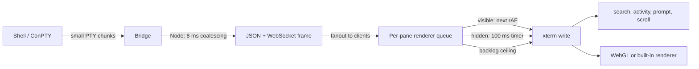

# MultiTerm Performance Engineering Guide

**Status:** Living document
**Last reviewed:** 2026-08-01

This document records MultiTerm's performance architecture, measured lessons,
tuning controls, known gaps, and regression practices. It covers both runtime
modes: Electron with the Node bridge and the installed browser application with
the embedded PowerShell/C# bridge.

## Executive summary

MultiTerm's practical hot path is not HTTP routing. It is:

1. shell output arriving in many small PTY chunks;
2. bridge serialization and WebSocket fanout;
3. browser event dispatch;
4. xterm writes, parsing, search bookkeeping, notifications, and scrolling;
5. GPU or DOM rendering;
6. layout, fit, PTY resize, and persistence work as panes change.

The current design reduces that work in layers:

- the Node bridge coalesces PTY output for 8 ms by default;
- one encoded WebSocket frame is reused across all eligible clients;
- the renderer drains live output once per animation frame when visible;
- hidden windows use a 100 ms timer and force a drain at a bounded backlog;
- WebGL is budgeted to 12 preferred panes, with DOM fallback and context-loss
  recovery;
- fit and resize work is coalesced, deduplicated, and held during window drags;
- multi-pane restore batches whole-app settings, pager, and persistence passes;
- search transcripts are maintained only while a filter needs them;
- expensive Windows process telemetry is on demand and deduplicated;
- multi-PTY teardown is serialized and staggered to avoid native crashes;
- nonvisual startup work is deferred to browser idle time.

The main limitations are:

- there is no end-to-end backpressure from xterm to the PTY;
- the installed C# bridge now honors the same configurable output coalescing,
  but it does not yet reuse one encoded frame across clients;
- `backgroundThrottling: false` preserves output consumption at the cost of
  background CPU and power;
- high scrollback, large output buffers, and many panes can still consume
  substantial memory;
- some counters called "bytes" or "KB" measure terminal payload or JavaScript
  string length, not complete WebSocket wire bytes or heap allocation;
- historical measurements are machine- and workload-specific and must not be
  presented as universal speedups.

## Performance goals and non-goals

### Goals

- Keep interactive input and UI controls responsive during noisy terminal output.
- Preserve output ordering and ensure final output arrives before `exited`.
- Keep hidden/minimized windows consuming output instead of replaying a huge
  burst on restore.
- Degrade from WebGL to the built-in renderer without blank panes.
- Avoid shell redraw corruption during continuous window resize.
- Bound memory-retaining structures and expensive periodic work.
- Keep one failed PTY, client, or renderer from stalling every session.
- Prefer measured, workload-specific changes over backend rewrites for their own
  sake.

### Non-goals

- Guaranteeing constant memory under an unbounded-output workload.
- Providing lossless end-to-end backpressure to shell processes.
- Guaranteeing identical throughput in the Node and installed bridges.
- Treating bridge payload counters as network accounting.
- Claiming WebGL is always faster on every GPU/driver.
- Calling 1,000,000-line scrollback truly unlimited.
- Claiming WASM or a native rewrite improves performance without benchmark data.

## Runtime topology and parity

The renderer is shared, but the bridge hot paths differ.

| Area | Electron/source mode | Installed/browser mode |
| --- | --- | --- |
| Bridge | [`server.js`](../../server.js) under system Node | Embedded C# in [`Start-MultiTerm.ps1`](../../Start-MultiTerm.ps1) |
| PTY | native `node-pty` over ConPTY | direct ConPTY P/Invoke |
| Bridge output coalescing | Configurable, default 8 ms, range 0-100 ms | Same renderer-controlled setting and final-output flush ordering |
| Broadcast encoding | One JSON/WebSocket frame reused across clients | Encodes and waits per client |
| Renderer batching | Shared rAF/hidden-timer pipeline | Same shared renderer |
| Memory/status sampling | PowerShell CIM subprocess | Native process enumeration/sampling |
| Teardown | Shell exit, Ctrl+C, second exit, force fallback; 150 ms stagger | Same staged sequence; host waits for session exit before closing its listener |
| Bridge recovery | Electron supervisor restarts the Node bridge and reuses a compatible detached bridge | Owning launcher and optional per-user watchdog monitor bridge lifetime |

The installed bridge avoids node-pty's native ABI and teardown bugs and now
coalesces burst output before WebSocket dispatch. It still performs encoding and
synchronous send work per client, so one slow client can extend a broadcast loop.
Protocol features and performance behavior must be checked in both implementations.

The optional watchdog polls only registered bridge records and their small
`/health` payloads. It does not inspect terminal output or sit in the PTY path.
Electron probes `/health` once at startup so a bridge detached by **Quit and keep
terminals** can be reused without a conflicting spawn. Destructive shutdown is
bounded: the bridges allow cooperative shell exit, interrupt a still-busy
foreground command, retry shell exit, then force only remaining sessions. The
installed host remains alive until exit callbacks drain or the bounded fallback
expires, preventing delayed continuation work from being abandoned.

Terminal messaging is event-driven and bridge-owned. Sending, listing, inserting,
and dismissing occur only on user or socket events; there is no polling and no work
in PTY output callbacks. Payload size and per-target pending capacity are user-configured.
The shared store is always bounded to 500 records or 4 MiB, and inbox bodies are
rendered only while the messaging surface is in use.

Workspace connection paths are SVG and pointer-transparent. Geometry updates are
coalesced through one animation-frame callback triggered by stage/host resize,
host scrolling, pane drag/layout/page/minimize/search changes, or route changes.
The observer deliberately does not watch pane subtree class mutations, so PTY
output and activity indicators cannot schedule connector work.

## End-to-end output pipeline



### Stage 1: bridge output coalescing

A PTY can emit a build log in thousands of small chunks. Source measurements in
[`server.js`](../../server.js) record roughly 11,000 chunks per second averaging
about 100 bytes for one colorized build workload, with approximately 6 microseconds
of browser event overhead per message. These are developer-workload observations,
not portable constants.

Both bridges store each session's pending chunks and flush them after the
configured `outputCoalesceMs` delay:

- default: 8 ms;
- minimum: 0 ms, which disables bridge coalescing;
- maximum: 100 ms;
- invalid input: reset to the 8 ms default.

Node timers are `unref()`'d; installed-bridge timers are disposed and removed
when their session exits. Pending output is synchronously flushed before the
`exited` event in both bridges, preserving the
observable ordering guarantee:

```text
last output bytes -> exited
```

Never move exit broadcast ahead of `flushSessionOutput`; doing so causes the
renderer to mark a session dead before its final prompt/error text arrives.

The setting is bridge-global, not per client or per session. The most recent
client `config` message sets the value for all sessions. Multiple clients with
different preferences can therefore overwrite one another; this is a known
configuration-ownership gap.

### Stage 2: encode once, write many

Output is broadcast to every connected client so multiple windows stay in sync.
The Node bridge lazily performs one `JSON.stringify` and one WebSocket frame
encoding, then passes the same immutable buffer to every real client. Test fakes
that lack `sendFrame` use the plain object path.

This removes duplicated serialization but fanout still performs one socket write
per client. Cost remains O(number of clients), and a slow client does not provide
an application-level flow-control signal to the PTY.

### Stage 3: renderer frame batching

Each terminal has a queue of raw output chunks. While the document is visible,
MultiTerm schedules one `requestAnimationFrame` and joins all queued chunks into
one `term.write`. The write then performs the associated work once:

- search transcript bookkeeping and visibility;
- activity and notification state;
- awaiting-input debounce;
- optional scroll-to-bottom.

This second batching stage remains valuable even with bridge coalescing because
multiple sessions and network scheduling can still deliver many messages within
one frame.

### Hidden and minimized windows

Browsers can stop `requestAnimationFrame` in hidden/minimized content. A source
measurement recorded zero rAF ticks over three seconds in minimized Chromium.
MultiTerm addresses this in two places:

- Electron sets `backgroundThrottling: false` so Chromium keeps servicing the
  renderer when the window is occluded;
- the renderer independently falls back to a 100 ms timer when `document.hidden`.

A visibility transition drains all terminal queues immediately. This prevents a
pending rAF from being stranded when the page goes hidden and prevents a hidden
timer from delaying output after the page becomes visible.

Disabling background throttling is a throughput/correctness tradeoff: background
terminals remain current, but Electron can use more CPU and power while hidden.

### Backlog ceiling and lack of true backpressure

The per-pane output buffer defaults to 1,024 KiB and is configurable from 64 KiB
to 65,536 KiB. When the queue reaches the configured ceiling, it drains
immediately instead of waiting for rAF or the hidden timer.

Important measurement detail: `pendingOutputBytes` currently increments by
JavaScript `string.length`. That counts UTF-16 code units, not UTF-8 payload bytes
and not heap allocation. The UI label is a practical tuning approximation.

The ceiling bounds how long output waits in the renderer queue; it does not pause
the WebSocket, bridge, ConPTY, or shell. There is no end-to-end backpressure.
Under sustained output faster than xterm can parse and render, the main thread
can still spend most of its time draining. A future backpressure design would
need explicit high/low watermarks and protocol support, not just a larger queue.

## GPU rendering and context management

### Why WebGL needs a budget

Chromium commonly limits live WebGL contexts per GPU process to about 16 and
force-loses the oldest context when the cap is exceeded. The xterm WebGL addon
used by MultiTerm can leave an evicted pane blank rather than transparently
falling back.

MultiTerm therefore sets `WEBGL_MAX_CONTEXTS = 12`, below the stock cap:

- active and visible panes receive highest priority;
- minimized, search-hidden, inactive-page, and nonzoomed panes are deprioritized;
- lower-priority addons are disposed before new ones attach;
- panes beyond the budget keep xterm's built-in renderer;
- the active/visible set is rebalanced as state changes.

Electron and the installed browser launcher also request Chromium's
`--max-active-webgl-contexts=64`. That is headroom for terminal and application
canvases, not permission to attach WebGL to every pane. The renderer's budget is
the correctness control and still works in a plain browser without the flag.

### Explicit fallback

After disposing a WebGL addon, MultiTerm restores xterm's pinned core renderer,
resizes it, and refreshes the terminal. DOM/built-in rendering is slower under
some heavy workloads but preferable to a blank pane.

### Context-loss recovery

A genuine GPU reset or driver failure triggers:

- disposal of the lost addon;
- a 300 ms recovery delay normally;
- a 1.5 second delay after more than three losses within eight seconds;
- pool rebalance and terminal refresh if the pane still exists.

This backoff avoids a rolling attach/loss loop. A single pane has at most one
scheduled recovery timer.

### What measurements support

Historical hardware testing with 19 panes recorded 16 live contexts, 3 lost,
and blank panes before budgeting, versus 12 live, 0 lost, and 0 blank after the
change. Source comments also record about 39% less renderer task time for WebGL
than the built-in renderer under one Copilot-style repaint workload.

The isolated renderer benchmark under
[`benchmarks/renderer-spike`](../../benchmarks/renderer-spike) showed roughly
56-57 ms WebGL task medians, 117-118 ms DOM medians, and 266-287 ms canvas medians
for its recorded Chrome/Windows/Intel workload. These results are not packaged
Electron measurements and do not predict every GPU or terminal workload.

CI commonly uses SwiftShader or a software GPU. The WebGL regression suite tests
budget and fallback behavior; it is not a reliable hardware performance result.

## Layout, fit, and PTY resize

### Fit coalescing

A layout mutation can notify both the pane and its screen `ResizeObserver`.
`scheduleFit` accepts only one pending fit per terminal and runs it on the next
animation frame. Panes hidden on inactive pages are skipped because their zero
geometry would produce nonsense PTY dimensions; they are refit when visible.

### Continuous window resize

A visual fit is cheap enough to keep panes following a window drag. Forwarding
every intermediate size to the shell is not: PSReadLine repaints the prompt at
many widths, racing xterm reflow and historically corrupting the displayed line
and cursor.

During an active window resize:

- visual fits continue;
- PTY resize messages are held;
- a 150 ms idle timer detects the settled window;
- one final size per terminal is sent afterward.

This suppression applies only to actual window resize events. Creation, pane
layout, and nonwindow observer changes still resize immediately so a delayed
shell repaint cannot clobber later output.

### Duplicate resize suppression

Both xterm `onResize` and fit-addon changes funnel through one `sendResize` guard.
Identical rows/columns are not sent twice. The cache updates only after a
successful bridge send, so reconnect does not permanently suppress a resize that
was attempted while offline.

## Restore, persistence, and whole-app batching

Restoring N panes used to call whole-app operations after every pane:

- `applySettings` walked all terminals;
- `renderPager` rebuilt the full tab strip;
- session/page snapshots synchronously serialized and wrote `localStorage`.

That produced O(N^2)-like behavior. Source measurements recorded restore work
rising from about 17 ms per pane at two panes to 34 ms per pane at thirteen.
`batchTerminalWork` now tracks nesting and runs each named whole-app task once at
the end of the burst.

Rules for extending batching:

- use a stable task name in `pendingBatchTasks`;
- make the final task idempotent;
- do not defer work needed to construct the next pane correctly;
- flush in `finally` so exceptions do not leave batch depth stuck;
- add a regression for both single-pane immediate behavior and multi-pane
  collapse.

`localStorage` is synchronous. Avoid writing it in output, animation, pointermove,
or resize hot paths. Save at semantic boundaries and batch repeated state changes.

## Search architecture

### Lazy transcript maintenance

The header filter needs searchable plain text, but stripping controls and
concatenating a large string on every output write is expensive when no filter
is active. MultiTerm treats xterm's buffer as authoritative:

- with no active filter, output marks `searchTextStale` and does no transcript
  string work;
- when filtering starts, the transcript is rebuilt by walking xterm buffer lines;
- while filtering remains active, subsequent output appends normalized text;
- each transcript is capped at 200,000 characters;
- trimming occurs only after a 40,000-character margin, amortizing string copies.

The first search after a long session therefore pays an on-demand buffer walk.
That is intentional: near-zero steady-state cost is more valuable than making a
rare first search free.

### Search refresh debounce

Every output frame cheaply decides whether a pane's transcript contains the
query. The authoritative highlighted search pass is scheduled only when a pane
changes hidden/visible state, with a 120 ms debounce. This avoids repainting all
search highlights for every terminal chunk.

### WASM search spike

[`benchmarks/search-index-wasm`](../../benchmarks/search-index-wasm) compares a
Rust/WASM indexing experiment with JavaScript for correctness, append, search,
and memory. No stable committed numeric result currently proves a production
benefit. WASM should not be adopted merely because it is native-like; crossing
the JS/WASM boundary and maintaining another index can cost more than the search
it replaces.

## Scrollback and memory bounds

- Normal scrollback defaults to 20,000 lines.
- The configured value is capped at 1,000,000 lines.
- "Infinite" scrollback also means 1,000,000 lines; it is not unbounded.
- Search transcripts are capped at 200,000 characters per pane while active.
- The in-app log console retains a bounded number of entries.
- Copilot log aggregation is disabled by default; its initial read defaults to
  256 KB per existing owned file and can be set to zero for follow-only mode.
- Renderer output queues have configurable per-pane drain ceilings.
- Pending request entries have timeouts and are removed when settled.

Large scrollback multiplies memory across panes and increases the first on-demand
search rebuild. Increasing output backlog can smooth bursts but retains more
strings and delays side effects. Tune both only for a demonstrated workload.

Durable diagnostics are written one JSON record per line and rotate at a visible
size threshold. The viewer-entry setting bounds the records returned to the
renderer, but the current reader still opens and parses every retained JSONL file
before taking the newest records. Copilot aggregation polls the dedicated owned
root once per second while enabled. Its initial-tail limit is per file, so many
retained process logs multiply startup I/O even though unrelated Copilot logs are
excluded. Retention and raw Copilot-log cleanup should be considered when
diagnosing a slow Logs panel or an unusually large diagnostics directory.

## Process statistics and memory telemetry

### Node bridge memory readout

Node mode collects process-tree working sets by launching a PowerShell CIM query.
Source observations record approximately 1.2 seconds wall time and roughly 360 ms
CPU for a fresh query on the development machine. To avoid paying that cost when
nobody is looking:

- the status chip requests data only while open/focused;
- concurrent requests join one in-flight query;
- successful results are cached;
- failed results are returned but not cached;
- timer-driven pushes require interest within the last 30 seconds;
- open/close events debounce their follow-up sample;
- periodic mode is opt-in through `MEMSTATS=1` and checks every 10 seconds only
  while recent interest exists.

The UI polls every four seconds while the chip is open. `MEMSTATS=1` does not
mean unconditional telemetry forever.

### Terminal statistics

Keystroke and terminal payload counters are updated in-process. CPU and memory
require an explicit request when the statistics dialog opens or refreshes.
Process-tree aggregation includes descendants and guards cycles/disappearing
processes.

Terminology matters:

- `bytesIn` and `bytesOut` are UTF-8 byte lengths of terminal payload strings;
- they exclude JSON syntax, WebSocket headers, TCP/IP overhead, retransmission,
  and broadcast multiplication;
- keystroke counts use JavaScript string units, not grapheme clusters;
- CPU is normalized across logical processors and capped for display;
- memory is process working set, not private bytes or total retained terminal
  history.

### Installed bridge telemetry

The C# bridge uses native process snapshots and a timed CPU sample rather than
spawning PowerShell CIM for every reading. Figures from the two bridge modes are
not guaranteed to use perfectly identical sampling semantics. Compare trends
within one mode rather than presenting cross-mode values as exact equivalents.

## Startup and background work

### Electron startup

- The default application menu is disabled before readiness so Electron never
  builds an unused menu.
- The Node bridge starts under system Node because the native node-pty binary must
  match the system Node ABI, not Electron's embedded Node ABI.
- Electron waits for `/health` before creating the renderer window.
- Cosmetic ripples, log-console binding, and automatic-update initialization are
  deferred with `requestIdleCallback` when available.

The first interactive terminal is the priority. Do not move filesystem scans,
telemetry, update checks, or whole-document enhancement work into the critical
path without a measured reason.

### Update progress

Installer download progress is throttled to at most about one renderer update per
150 ms until completion. Without throttling, a large download could flood IPC and
repaint the progress UI for every network chunk.

## Session teardown and native stability

Node/node-pty teardown is a reliability and performance problem, not merely a
cleanup detail. Concurrent ConPTY closure was observed to abort the bridge with
an access violation around eight simultaneous closes on tested node-pty versions.
The current strategy is:

1. mark the session as closing synchronously;
2. send shell `exit` and allow 2.5 seconds;
3. send interrupt and allow another 2.5 seconds;
4. force-kill only as a last resort;
5. stagger bulk teardown starts by 150 ms;
6. poll shutdown drain up to eight seconds rather than exiting on a guessed fixed
   delay;
7. flush pending output before broadcasting exit.

Tmux-backed sessions detach the client rather than terminating the tmux server.
The installed ConPTY bridge also serializes/staggers closure, but does not share
node-pty's native module failure mode.

Avoid broad synchronous close loops and avoid assuming `terminal.kill()` is a
cheap, harmless operation on Windows ConPTY.

## Recovery and supervision

The renderer reconnects with capped exponential backoff:

```text
0.5 s -> 1 s -> 2 s -> 3 s -> 3 s ...
```

Only one reconnect timer may exist. On reconnect, the bridge sends its session
catalog and the renderer reattaches existing panes instead of blindly respawning.
A terminal missing from the catalog is marked lost.

Electron supervises an unexpectedly exited Node bridge. It restarts the child
unless the process is quitting, the exit was clean, or five restart attempts have
already occurred within ten seconds. The crash-loop ceiling prevents a broken
native bridge from consuming CPU indefinitely.

A bridge process crash still loses the PTYs it owns. Reconnect preserves sessions
only when the original bridge remains alive.

## Compositor and CSS lessons

Live terminal output makes expensive effects more visible. Two changes matter:

- awaiting-input emphasis animates opacity on a pseudo-element overlay rather
  than animating a large pane `box-shadow` every frame;
- the pane status pill avoids `backdrop-filter`, which would continually
  resample live output behind it.

Prefer compositor-friendly opacity/transform animation. Profile blur, filters,
large shadows, and layout-affecting animation over actively repainting terminals,
not over static mock content.

## Performance controls

| Control | Default | Range/effective cap | Tradeoff |
| --- | ---: | ---: | --- |
| Output batching | 8 ms | 0-100 ms | Lower latency versus more JSON/events; Node bridge only and bridge-global |
| Output buffer | 1,024 KiB | 64-65,536 KiB per pane | Earlier drains/lower retained queue versus smoother bursts/more memory |
| Scrollback | 20,000 lines | 1-1,000,000 | Search/history versus memory and rebuild cost |
| Infinite scrollback | Off | 1,000,000 lines | Large but bounded history |
| WebGL contexts | 12 | Fixed source constant | Faster preferred panes versus Chromium context safety |
| Hidden flush | 100 ms | Fixed source constant | Background batching versus freshness |
| Window resize settle | 150 ms | Fixed source constant | Avoid prompt churn versus delayed PTY dimensions during drag |
| Search transcript | 200,000 chars | 40,000-char trim margin | Filter reach versus string memory/copy cost |
| Search repaint debounce | 120 ms | Fixed source constant | Highlight freshness versus repaint frequency |
| Memory interest window | 30 s | Fixed source constant | Avoid unattended CIM work versus cache freshness |
| Maximum installer size | 256 MB | User-selected positive whole MB value | Bounds update disk/network work; exact size and SHA-256 are still required |

### Tuning guidance

- Keep output batching near 8 ms unless a measured interactive workload needs
  lower latency or a high-throughput workload benefits from a longer window.
- Do not set output batching to zero as a general "performance" fix; it increases
  browser event and serialization pressure.
- Lower the output buffer when memory retention matters more than burst smoothing.
  Raise it only after observing frequent immediate drains and acceptable memory.
- Reduce scrollback before increasing process memory limits.
- Leave the WebGL budget below the browser's unmodified context cap.
- Compare Node and installed bridge behavior before attributing a renderer stall
  solely to xterm.
- Change one control at a time and record pane count, workload, visibility state,
  bridge mode, hardware, browser/Electron version, and before/after metrics.

## Measurement evidence and caveats

| Observation | Source and qualification |
| --- | --- |
| About 11k PTY chunks/s averaging about 100 bytes; about 6 microseconds browser event plumbing | Source comment in [`server.js`](../../server.js); one colorized build workload on development hardware |
| WebGL used about 39% less renderer task time than built-in renderer | Source comment in [`public/app.js`](../../public/app.js); Copilot-style repaint workload, not universal |
| 19 panes: 16 contexts/3 lost before, 12/0 after | Historical hardware run summarized in [README](../../README.md); regression proves budget, not GPU speed |
| Restore rose from 17 ms/pane at 2 panes to 34 ms at 13 before batching | Source comment in [`public/app.js`](../../public/app.js); procedure/raw trace not preserved |
| Minimized Chromium produced zero rAF ticks over 3 seconds | Source comment in [`main.js`](../../main.js); motivated disabling background throttling |
| Node memory query about 1.2 s wall and 360 ms CPU | Source comment in [`server.js`](../../server.js); machine-dependent CIM startup/sample cost |
| Concurrent closure around 8 PTYs could crash node-pty | Historical development reproduction; do not treat eight as a universal threshold |

Source comments preserve useful engineering context, but a claim without a raw
artifact, environment, and repeatable procedure is a historical observation.
When publishing performance numbers, include:

- commit and version;
- Windows, browser/Electron, Node, xterm, and GPU/driver versions;
- bridge mode;
- pane count, dimensions, scrollback, visibility, and WebGL count;
- input workload and duration;
- warm-up and run count;
- median and tail latency, not only averages;
- CPU, working set, task time, dropped/lost contexts, and correctness checks.

## Benchmarks

### Renderer spike

Run:

```powershell
npm run benchmark:renderer
```

Use headed mode to inspect visual/GPU behavior:

```powershell
npm run benchmark:renderer:headed
```

The benchmark implementation is in
[`benchmarks/renderer-spike/bench.spec.js`](../../benchmarks/renderer-spike/bench.spec.js).
It compares renderer strategies under a synthetic update stream. Do not compare
results across machines without recording the environment, and do not assume a
headless/software-GPU result predicts Electron on hardware acceleration.

### Search WASM spike

Run:

```powershell
npm run benchmark:search-wasm
```

The harness is in
[`benchmarks/search-index-wasm/run.js`](../../benchmarks/search-index-wasm/run.js).
It evaluates correctness as well as append/search/memory behavior. A rewrite is
justified only if repeatable production-like measurements beat the simpler
JavaScript path without regressing memory or correctness.

### Product-level testing

Synthetic benchmarks cannot validate terminal correctness. Performance changes
must also run the real bridge and browser suites, especially output ordering,
reconnect, resize, context loss, teardown, and hidden-window cases.

## Regression map

| Concern | Primary tests |
| --- | --- |
| Bridge coalescing, frame reuse, and config clamping | [`tests/unit/server-pure.test.js`](../../tests/unit/server-pure.test.js), [`tests/unit/server-sessions.test.js`](../../tests/unit/server-sessions.test.js), [`tests/unit/start-multiterm-performance.test.js`](../../tests/unit/start-multiterm-performance.test.js) |
| Node/installed message dispatch parity | [`tests/unit/bridge-protocol-parity.test.js`](../../tests/unit/bridge-protocol-parity.test.js) |
| Teardown grace, force-kill, and stagger | [`tests/unit/server-sessions.test.js`](../../tests/unit/server-sessions.test.js) |
| Memory interest, in-flight dedupe, and process trees | [`tests/unit/server-logging-mem.test.js`](../../tests/unit/server-logging-mem.test.js), [`tests/unit/server-statistics.test.js`](../../tests/unit/server-statistics.test.js), [`tests/unit/start-multiterm-statistics.test.js`](../../tests/unit/start-multiterm-statistics.test.js) |
| Renderer queue, hidden timer, backlog, search, and batch edges | [`tests/e2e/coverage-completion.spec.js`](../../tests/e2e/coverage-completion.spec.js) |
| WebGL budget and fallback | [`tests/e2e/webgl-budget.spec.js`](../../tests/e2e/webgl-budget.spec.js) |
| Context-loss recovery, resize settling, and real terminal output | [`tests/e2e/app.spec.js`](../../tests/e2e/app.spec.js) |
| Reconnect backoff and session adoption | [`tests/e2e/bridge-reconnect.spec.js`](../../tests/e2e/bridge-reconnect.spec.js) |
| Renderer benchmark methodology | [`benchmarks/renderer-spike/bench.spec.js`](../../benchmarks/renderer-spike/bench.spec.js) |

The current suite proves behavior and many ceilings. It is not a continuous
performance gate: passing tests does not prove latency or memory stayed flat.
Benchmark baselines should be versioned if quantitative regression gating becomes
a release requirement.

## Diagnostic playbook

### UI freezes during heavy output

1. Record bridge mode, pane count, WebGL count, visibility, output batching, and
   output buffer settings.
2. Compare one noisy pane versus many noisy panes.
3. Inspect browser performance traces for WebSocket dispatch, `term.write`,
   search work, style/layout, paint, and long tasks.
4. Disable active header filtering and notifications to isolate side effects.
5. Compare Node and installed bridge; a difference can still indicate per-client
  encoding/fanout or telemetry overhead.
6. Lower scrollback and confirm whether memory pressure or GC changes.
7. Do not simply enlarge the backlog; that may delay and amplify the eventual
   main-thread write.

### Panes become blank or flicker

1. Count live WebGL addons and verify it never exceeds 12.
2. Check `webglcontextlost`, GPU process resets, driver blocklisting, and
   software rendering.
3. Confirm DOM fallback renders panes beyond the budget.
4. Verify the launcher context-ceiling flag is present, but do not rely on it in
   place of the renderer budget.
5. Run the WebGL budget and context-loss regressions.

### Memory grows

1. Separate process working set from terminal payload counters.
2. Multiply scrollback and output-buffer settings by pane count.
3. Check active search transcripts, log console size, notes/queues, workspaces,
   and hidden panes.
4. Determine whether output is sustained faster than the renderer drains.
5. Compare after clearing scrollback or reducing pane count.
6. Avoid interpreting the status-chip aggregate as retained JavaScript heap.

### Prompt corruption during resize

1. Confirm the visual fit still runs during drag.
2. Confirm PTY resize messages are suppressed until the 150 ms settle.
3. Verify identical dimensions are deduplicated.
4. Test creation/layout resize separately; those must not inherit drag delay.

### Slow startup or restore

1. Separate shell spawn latency from renderer startup.
2. Confirm nonvisual work remains under `whenIdle`.
3. Verify restore uses `batchTerminalWork` around multi-pane creation.
4. Profile synchronous `localStorage`, terminal construction, addon loading,
   fit/layout, and shell startup independently.
5. Do not rewrite the bridge for an xterm or shell-startup bottleneck.

## Anti-patterns to avoid

- Writing every PTY chunk directly to xterm.
- Broadcasting an independently encoded frame to each client.
- Relying only on rAF for hidden-window output.
- Increasing queue sizes without measuring retained memory and drain time.
- Creating WebGL addons for every pane because the launcher raises Chromium's
  ceiling.
- Reattaching a lost WebGL context immediately in a tight loop.
- Sending every intermediate window size to PSReadLine.
- Running whole-app settings/persistence after every pane in a restore loop.
- Maintaining a duplicate search transcript when no feature reads it.
- Polling CIM or process statistics continuously when the UI is closed.
- Closing many ConPTYs concurrently.
- Adding blur, filters, or animated large shadows over live terminal output
  without compositor profiling.
- Calling historical source comments a benchmark result without preserving the
  environment and raw data.
- Assuming a native or WASM rewrite is faster without measuring the actual hot
  path.

## Future performance work

Prioritized opportunities:

1. Add one-encode fanout to the installed C# bridge and define how slow clients
  are timed out or disconnected instead of blocking fanout.
2. Define optional high/low-watermark protocol flow control if sustained output
   can demonstrably outrun xterm despite batching.
3. Move Node process telemetry from PowerShell CIM to a native API or shared
   helper if profiling shows the on-demand cost still matters.
4. Persist benchmark metadata/results in a normalized format and establish
   versioned baselines before enforcing budgets.
5. Replace approximate backlog "bytes" with explicitly named code units or track
   UTF-8 bytes if that distinction affects tuning.
6. Decide ownership semantics for bridge-global performance configuration when
   multiple clients connect.
7. Evaluate a unified backend only against the acceptance criteria in
   [Architecture Design Decisions](../architecture/designdecisions.md): stability,
   cleanup, startup, or memory must improve measurably.

## Performance-change checklist

- Identify the actual hot path with a trace or reproducible workload.
- State the expected latency, throughput, CPU, memory, or correctness outcome.
- Record the baseline environment and multiple runs.
- Preserve output order, Unicode correctness, resize semantics, and exit order.
- Check visible, hidden, minimized, inactive-page, and disconnected states.
- Test both Node/Electron and installed bridge behavior where relevant.
- Bound every new queue, cache, transcript, timer, and retry loop.
- Cancel timers/observers/addons during terminal disposal.
- Avoid synchronous storage or process work in output and animation paths.
- Verify degradation when WebGL, native telemetry, or a newer protocol feature
  is unavailable.
- Run focused tests, full unit tests, browser tests, and the relevant benchmark.
- Document measurements with qualifications and update this guide when a new
  invariant or failure mode is learned.

The governing lesson is simple: optimize where work multiplies. In MultiTerm,
that means chunks times messages, clients, panes, frames, buffer lines, and
whole-app passes. Preserve correctness first, then collapse repeated work at the
narrowest boundary that sees it.
