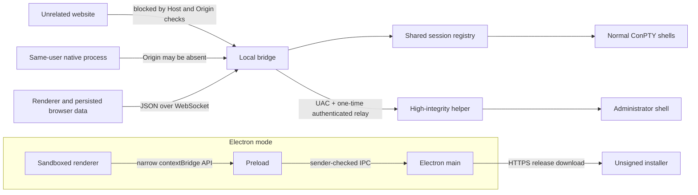

# MultiTerm Security Engineering Guide

**Status:** Living document
**Last reviewed:** 2026-08-01

This document records the security model, implementation lessons, known gaps,
and review practices for MultiTerm Workbench. It is an engineering reference,
not a claim that the application is secure against every local attacker.

## Executive summary

MultiTerm is a terminal host. Any accepted client can ultimately send text to a
shell, so its most important security boundary is the local bridge endpoint.
The default configuration has credible protections against unrelated websites:

- the bridge binds to loopback;
- ordinary HTTP requests require a loopback-literal `Host` header;
- browser WebSocket requests require an exact loopback origin, host, and port;
- Electron runs the renderer sandboxed, context-isolated, and without Node;
- privileged Electron IPC verifies the sender and exposes a narrow preload API;
- elevated helpers authenticate their one-shot relay and verify the bridge PID;
- app-composed shell text is constrained to one visible line and revalidated
  when loaded from persistence;
- updates are restricted to HTTPS release assets under the official GitHub path
  and must match GitHub's exact size and SHA-256 digest before launch;
- the maximum installer size is a visible, persisted Performance setting;
- external Electron handoff accepts HTTPS only;
- legacy remote-mode flags fail closed and both bridges bind to loopback only.

The most important limitations are equally explicit:

1. Ordinary bridge clients are not authenticated. A native process running as
   the same user can connect without an `Origin`, enumerate shared sessions,
   send input, stop sessions, invoke filesystem actions, and request elevation.
2. The updater does not Authenticode-verify the installer or publisher before
  execution because release installers are currently unsigned. GitHub's asset
  digest detects transfer/asset mismatch but shares the repository trust root.
3. Electron containment applies only to Electron mode. The installed launcher
   uses the user's normal browser and the separate PowerShell/C# bridge.
4. The Node and PowerShell/C# bridges implement the protocol independently;
   every security change must be reviewed and tested in both.

## Scope and execution modes

The same renderer can run against two different bridge implementations. Never
assume that a control in one path automatically protects the other.

| Mode | Host and bridge | Additional boundary | Important difference |
| --- | --- | --- | --- |
| Electron/source | [`main.js`](../../main.js), [`preload.js`](../../preload.js), and [`server.js`](../../server.js) | Sandboxed Electron `BrowserWindow` and checked IPC | Includes the in-app updater and Node/node-pty bridge |
| Installed/browser | [`Start-MultiTerm.ps1`](../../Start-MultiTerm.ps1) | User's external browser security model | Embedded C# serves HTTP/WebSocket and owns ConPTY directly |
| Node/browser development | [`server.js`](../../server.js) in a normal browser | Browser origin rules only | No Electron sandbox or IPC boundary |
| Per-pane administrator terminal | Node helper in [`elevated-pty-host.js`](../../elevated-pty-host.js), or the installed bridge's `-ElevatedHost` path | UAC integrity boundary and authenticated one-shot relay | High-integrity helper owns the elevated ConPTY |
| Whole-window elevation | Electron or launcher is restarted with UAC | Entire app and every child run elevated | Any bridge compromise now has administrator impact |

See [Architecture Design Decisions](../architecture/designdecisions.md) for why
the two bridges still exist and why backend unification requires measured proof.

## Trust boundaries

The significant trust transitions are:

- browser or native client to the local HTTP/WebSocket bridge;
- sandboxed renderer to preload and Electron main;
- bridge to normal shell process;
- medium-integrity bridge to high-integrity helper;
- application to filesystem, clipboard, native dialogs, Explorer, and updater;
- build system to npm packages, vendored browser assets, native binaries, and
  release artifacts.

## Threat model

### Attackers considered

- a malicious website visited in a browser on the same machine;
- a DNS-rebinding page that resolves its own hostname to loopback;
- a compromised renderer, extension, or same-origin script;
- malformed or tampered WebSocket messages;
- tampered `localStorage`, update preferences, or older persisted data;
- clipboard content, script paths, terminal output, and release metadata;
- a native process running as the same Windows user;
- a compromised GitHub release or dependency supply chain;
- accidental or hostile resource exhaustion;
- failures while creating, resizing, logging, elevating, or tearing down PTYs.

### Security goals

- Unrelated browser origins must not be able to drive local shells by default.
- A remote page must not acquire Electron preload or Node capabilities.
- High-integrity helpers must reject an impostor bridge before accepting input.
- App-generated shell input must not hide extra lines or terminal controls.
- Untrusted paths must not become shell command text.
- Malformed clients and isolated PTY errors should not drop every session.
- Release and installer operations should fail closed when their expected
  repository, transport, target commit, or artifact shape is wrong.

### Non-goals

- Isolating sessions from other processes running as the same Windows user.
- Providing per-client session ownership or authorization.
- Making arbitrary commands, typed input, or clipboard contents harmless.
- Encrypting terminal history, notes, logs, or preferences at rest.
- Protecting an already elevated whole-app instance from its accepted clients.
- Proving publisher identity for the current unsigned installer.

## HTTP and WebSocket boundary

### Loopback is necessary, not sufficient

Both bridges bind to `127.0.0.1` by default. This keeps ordinary network peers
out, but it does not stop a browser page on the same machine. Browser requests
to loopback also originate locally, and DNS rebinding can make a hostile page
same-origin with a loopback service.

The shared policy in [`ws-origin.js`](../../ws-origin.js) therefore accepts only
the literal hosts `127.0.0.1`, `localhost`, and `::1`.

### HTTP Host validation and DNS rebinding

An ordinary HTTP request is rejected unless its `Host` header parses as a
loopback literal. The policy rejects credentials, paths, queries, and fragments
rather than accepting lenient URL interpretations.

This matters because a rebinding page keeps its attacker-controlled hostname in
`Host` even after DNS resolves it to `127.0.0.1`. Rejecting that hostname stops
the page from becoming same-origin with `/health`, static assets, or update
preferences. The Node check is in [`server.js`](../../server.js); the installed
bridge mirrors it in [`Start-MultiTerm.ps1`](../../Start-MultiTerm.ps1).

### WebSocket Origin validation

Browser WebSocket handshakes must use HTTP(S), a loopback-literal hostname, and
the exact hostname and port from the WebSocket `Host` header. Allowing every
localhost port would let an unrelated local web application drive shells.

A missing `Origin` is deliberately accepted for native clients and automation.
Browser JavaScript supplies `Origin` and cannot forge it, so absence distinguishes
a non-browser client for the cross-site threat. It is not authentication: a
same-user native process can omit `Origin` and receives full bridge access.

### Remote mode is disabled

Legacy `ALLOW_REMOTE=1` and `-AllowRemote` requests now fail at startup. Both
bridges reject non-loopback bind hosts, and Host, source-address, and Origin
checks are unconditional. This removes the unauthenticated plaintext shell
exposure instead of attempting to make it safe with a partial control.

Any future remote design is a new security architecture and needs, at minimum:

- TLS with explicit certificate validation;
- client authentication;
- per-client authorization and session ownership;
- CSRF/WebSocket-origin policy appropriate to the deployment;
- command and connection rate limits;
- auditing, revocation, and secret rotation;
- a documented network firewall boundary.

### Static files and response policy

The Node static server decodes the path, normalizes it beneath `public/`, checks
`path.relative`, and rejects traversal outside that directory. Responses use
`no-store`, explicit MIME types, and security headers.

The CSP and companion headers enforce:

- scripts, fonts, frames, and network access from approved sources only;
- no objects, forms, workers, media, or foreign framing;
- same-origin opener/resource policies;
- no camera, microphone, geolocation, payment, or USB;
- no referrer leakage and no MIME sniffing.

Inline styles remain allowed because the UI uses them. CSP is exploit mitigation,
not client authorization. `help.html` is the one same-origin frame exception and
receives a correspondingly scoped frame policy.

### Protocol parsing and availability ceilings

The Node implementation requires RFC 6455 version 13, client masking, and a
maximum message size of 1 MiB. It caps concurrent clients at 32 and sessions at
64. The installed bridge mirrors the headline client/session limits and uses a
bounded receive buffer.

Update-preference requests are local-only, require the custom
`x-multiterm-request: Renderer` marker, cap JSON at 4 KiB, validate exact types,
clamp the interval, and write through a random temporary file before rename.
The marker is a CSRF signal, not a secret; Host validation is what prevents a
DNS-rebound page from becoming same-origin and adding it.

Bridge lifecycle controls follow the same principle. `/shutdown` and
`/watchdog/keep` accept only loopback `POST` requests carrying
`x-multiterm-request: Launcher`; navigation and remote-source requests fail
closed. The header is not authentication against another process running as the
same user. Electron main uses `/watchdog/keep` and waits for its response before
quitting while terminals remain, so renderer teardown cannot race suppression
persistence.

Each bridge atomically writes a discovery record beneath
`%LOCALAPPDATA%\MultiTerm\Instances`. The per-user watchdog accepts a record only
when its PID, port, loopback URL, process start time, and `/health` identity agree.
Records are discovery hints, not authority: they are user-writable and every
control decision must be revalidated against the live endpoint. The watchdog is
an interactive per-user agent, not a privileged Windows Service.

Ceilings are availability controls, not access control. Accepted clients still
share one session pool, and there is no per-client quota or request-rate limit.

## Electron renderer and IPC boundary

Electron mode applies the following explicitly rather than relying on defaults:

- `contextIsolation: true`;
- `nodeIntegration: false`, including subframes and workers;
- `sandbox: true`;
- `webviewTag: false`;
- `webSecurity: true`;
- no insecure content or experimental features;
- top-level navigation pinned to the app's local origin;
- external HTTP(S) links opened in the default browser;
- all permission requests denied;
- synchronous permission checks limited to clipboard operations from the exact
  internal origin.

[`preload.js`](../../preload.js) exposes only the capabilities the renderer
needs: clipboard write, script picker, close/tray response, focus, elevation,
and update operations. It does not expose Node, filesystem, shell, or arbitrary
IPC primitives.

Every privileged handler in [`main.js`](../../main.js) checks:

- the sender is the current application `WebContents`;
- a supplied sender frame is the main frame;
- the sender URL is the exact internal loopback origin and port.

A compromised trusted renderer can still invoke the exposed preload and bridge
capabilities. Sandboxing limits ambient OS access; it does not make the trusted
application API harmless. The installed browser mode does not receive this
application-controlled Electron containment.

## Bridge client authority and session sharing

The ordinary bridge protocol supports creation, input, resize, termination,
`killAll`, logging, filesystem reveal/open, native script picking, statistics,
configuration, tmux discovery, and elevation. It has no login token, client
identity, per-session owner, or least-privilege capability negotiation.

Sessions are intentionally shared across connected clients. Output and lifecycle
events are broadcast so a reconnecting or second window can adopt live sessions.
That design also means any accepted client can observe session metadata and send
commands to sessions created by another client.

Important consequence: the one-time elevation token does not authenticate the
ordinary WebSocket client. It authenticates only the high-integrity helper back
to the bridge.

## Administrator terminals

Windows does not allow a medium-integrity process to host a high-integrity child
through the same ConPTY. MultiTerm therefore launches a helper with UAC; that
helper owns the elevated ConPTY and relays terminal data over a one-shot loopback
socket.

The Node elevation path provides:

- a cryptographically random 32-byte token;
- a loopback listener on an ephemeral port;
- one accepted connection per attempt;
- a 120-second connection timeout and 15-second authentication timeout;
- constant-time token comparison after checking equal lengths;
- base64 framing for terminal data inside newline-delimited JSON;
- bridge PID and command-line verification by the high-integrity helper before
  it creates or feeds the elevated PTY;
- UAC cancellation and launcher errors surfaced without crashing the bridge;
- final buffered output flushed before the session's exit event.

[`elevated-pty-host.js`](../../elevated-pty-host.js) independently verifies that
the listener port belongs to the expected bridge PID and that its command line
contains `server.js`. This prevents a lower-integrity impostor from learning the
token and substituting its own listener. The installed bridge implements the
same design in embedded C# and its `-ElevatedHost` mode.

Residual risks:

- any accepted ordinary client can request a UAC prompt;
- if the user approves, the elevated session joins the shared session registry;
- same-user process isolation is not provided;
- whole-window elevation raises the impact of any renderer or bridge compromise;
- PID/command-line verification and token handling must remain in both bridges.

## Shell input and command construction

### Raw input remains raw

A terminal is useful because keystrokes and paste can execute arbitrary commands.
Normal xterm input flows to the PTY. Programmatic paste uses xterm's paste path so
newline normalization and bracketed-paste framing work when the terminal enables
mode 2004. Right-click auto-run modes display an explicit first-use warning.

Do not describe raw typing or clipboard paste as sanitized.

### Terminal message handoffs

The initial terminal messaging feature is bridge-owned and same-instance only. Both bridges validate kind, live/non-closing source and target sessions, required fields, and the user-configured UTF-8 payload size before storing a pending message. Per-target inbox capacity is user-configured; `0` disables that quota, but an invariant global ceiling of 500 pending records or 4 MiB always bounds bridge memory and list responses.

The renderer builds inbox rows with DOM/text APIs and creates body DOM only while the inbox is open. The only PTY action is an explicit receiver **Insert**. At that final PTY boundary, both bridges revalidate the stored text and reject C0/C1 controls, including CR/LF, tab, ESC, and DEL. The record is consumed only after the target confirms a write; a failed write leaves it pending. Target exit expires pending records and broadcasts their removal, preventing a later session that reuses the same ID from inheriting a stale handoff. **Dismiss** never writes to the shell.

The source terminal is sender-selected context, not authenticated provenance. The UI labels it accordingly. Durable delivery and automatic execution are rejected rather than partially implemented. Future CLI attribution, cross-instance routing, and automation rules require separate capability and consent controls.

Per-pane elevated terminals use a relay whose current input protocol has no positive PTY-write acknowledgment. Both bridges therefore reject terminal messages targeting an elevated relay instead of consuming a record after an ambiguous socket write. Direct input keeps its existing relay behavior; enabling message Insert requires an acknowledged helper protocol in both implementations.

Directional GUI links are renderer-only visual metadata stored in `multiterm.terminalLinks`. Loaded records are capped, require two distinct bridge-shaped session IDs, and are pruned unless both sessions are live. Link labels and route rows use DOM/text APIs. A link does not alter bridge authorization, write to a PTY, imply authenticated provenance, or cause message delivery.

### App-composed commands are one visible line

Commands generated or stored by the application, including snippets, broadcasts,
queued commands, startup commands, and slash-command arguments, use
`safeTerminalCommand` in [`public/app.js`](../../public/app.js). It:

- removes C0/C1 controls, CR/LF, ESC, tab, DEL, and Unicode line separators;
- collapses the removed regions to visible spaces;
- rejects empty values;
- rejects values longer than 8,192 characters rather than truncating them.

Rejecting over-length values is important. Truncating a command can produce a
different but still executable and more dangerous command. Persisted queues are
revalidated when loaded from `localStorage`; stored data is not trusted merely
because an earlier build wrote it.

This framing prevents hidden submissions and display-control tricks. It does not
judge shell semantics or make a visible command safe.

### Argument and path handling lessons

- Shell selection is an allowlisted lookup, not a client-supplied executable.
- tmux distro/session values reject control characters, require bounded non-empty
  strings, and are passed as argument-array elements to `wsl.exe`.
- working directories must resolve to existing directories or fall back safely.
- the Node native script picker passes the initial directory through an
  environment variable instead of interpolating it into PowerShell source.
- Windows file opening uses `Start-Process -LiteralPath` with the path in an
  environment variable. It does not use `cmd.exe /c start`, because legal `&` or
  `|` characters in a filename could otherwise be reparsed as commands.
- Electron's picker returns only a selected path; the renderer still applies the
  shell-specific quoting rules when constructing the visible command.

## Untrusted output, release notes, and links

Terminal output is untrusted and can contain ANSI/OSC controls. xterm handles the
terminal protocol; plain-text logs and search text strip controls appropriate to
their destination. This stripping is not an output authentication mechanism.

Release notes from GitHub are rendered with DOM nodes and text content rather
than inserted as HTML. Continue treating release names, notes, and asset metadata
as untrusted network data.

Terminal web links and external application links leave the Electron window and
open through the OS. Top-level navigation forwards only HTTP(S), but the current
window-open handler forwards any noninternal URL to `shell.openExternal` without
an explicit scheme allowlist. xterm's normal WebLinks path produces web URLs,
but a compromised renderer could exercise the broader handler. Restrict popup
handoff to explicitly supported schemes (normally HTTPS, with HTTP only when
intended) and regression-test rejected schemes.

## Filesystem, logs, and persistence

### Static and native path operations

- static content is confined to `public/`;
- reveal/open operations require an existing resolved path;
- paths are passed as process arguments or environment data, never concatenated
  into `cmd.exe` source;
- log names allow only alphanumeric characters, dot, underscore, and dash and
  are capped at 60 characters;
- update preferences use a same-directory temporary file and atomic rename.

These controls prevent traversal and command parsing. They do not restrict an
accepted client to files created by MultiTerm.

### Sensitive local data

Terminal logs are stored under `~/MultiTerm/logs` and can contain commands,
credentials, tokens, paths, and command output. Notes, queues, workspaces,
session metadata, and preferences are stored in the browser profile or local
application data. There is no encryption-at-rest or retention policy.

Users and maintainers should treat exported logs, browser profiles, crash traces,
and test artifacts as sensitive. A future privacy pass should define retention,
delete controls, and redaction guidance.

The `/health` endpoint reports the current working directory. It is protected by
the default Host boundary but should not accumulate additional sensitive data.

## Updater and release trust

The Electron updater:

- obtains release metadata from the configured GitHub API;
- accepts installer URLs only with HTTPS, hostname `github.com`, no credentials,
  port, query, or fragment, the configured repository's `/releases/download/`
  prefix, and an `.exe` filename matching the asset metadata;
- follows at most five redirects and refuses a downgrade away from HTTPS;
- applies network timeouts;
- requires GitHub release metadata to provide a SHA-256 digest and exact positive
  asset size;
- incrementally hashes bytes during the existing stream and rejects any digest,
  metadata-size, response-size, or actual-byte mismatch before launch;
- enforces the user's persisted **Maximum installer size (MB)** Performance
  setting (default 256 MB, with no hidden application maximum);
- stages each download in a fresh `mkdtemp` directory to reduce predictable-path
  replacement attacks;
- throttles progress events before crossing IPC;
- launches the installer only after the file stream finishes.

The unresolved trust gap is publisher verification. The installer is currently
unsigned, so the updater cannot require a valid Authenticode publisher without
rejecting every legitimate release. The verified GitHub digest protects against
corruption and a release-asset mismatch, but a repository compromise can replace
both the asset and its metadata.

HTTPS and a GitHub path protect transport and repository selection; they do not
prove installer publisher identity if the repository or release is compromised.
The implementation plan is tracked in [`plans/TODO.md`](../../plans/TODO.md):
sign releases, verify Authenticode and the expected publisher before execution,
delete failed artifacts, and cover valid and invalid signatures in tests.

## Installer, PATH, and Explorer integration

[`installer/MultiTerm.iss`](../../installer/MultiTerm.iss) defaults to a per-user
install without UAC. Machine-wide installation, machine PATH modification, and
Explorer integration are optional tasks.

Security lessons:

- machine PATH changes belong only to the Program Files installation and must
  remove only entries owned by the MultiTerm installation marker;
- `ExecutionPolicy Bypass` lets a known script execute; it is not signature or
  trust validation;
- Explorer integration ships architecture-specific native DLL/EXE/MSIX payloads;
- its sparse package is signed with a generated self-signed certificate, and the
  optional installation may add that certificate to `TrustedPeople`;
- that certificate enables package installation but is not independent proof of
  publisher identity;
- installer upgrades and uninstall must clean only MultiTerm-owned registrations,
  PATH entries, package registrations, and certificates.

Any change to native Explorer binaries, certificate handling, PATH scope, or
installer privilege should receive a dedicated security review on x86, x64, and
ARM64.

## Dependency and build supply chain

The Electron/Node path depends on Electron and the native
`@homebridge/node-pty-prebuilt-multiarch` package. Browser dependencies are
vendored under `public/vendor/`; the installed bridge avoids Node and node-pty but
includes embedded C# and native Explorer components. The lockfile records npm
integrity hashes, which provide acquisition consistency but not protection from
a compromised maintainer or registry release.

Release reviews should include:

- `npm audit` and dependency-diff review;
- lifecycle scripts and native prebuilt binaries;
- Electron/Chromium security support status;
- vendored xterm/addon provenance and notices;
- installer payload inventory and architecture matrix;
- reproducibility or provenance metadata where practical;
- signed commits/tags and signed release artifacts when available;
- an SBOM for shipped native and JavaScript components.

## Availability and fault containment

Security includes keeping unrelated sessions alive when one client or PTY fails.
Implemented controls include:

- 1 MiB WebSocket message limit;
- 32-client and 64-session ceilings;
- 4 KiB update-preference request limit;
- timeouts on update requests, process sampling, WSL discovery, and elevation;
- malformed-frame and message-handler errors isolated to the client path;
- PTY logging failures isolated from the live session;
- bridge-level uncaught exception/rejection logging so one native callback does
  not automatically terminate every session;
- Electron bridge restart supervision capped at five attempts per ten seconds;
- graceful PTY exit, interrupt, and last-resort kill sequencing;
- staggered multi-session teardown to avoid native ConPTY/node-pty crashes.

These are damage limits, not defenses against a determined accepted client.
There is no per-client rate limit, per-client session quota, or permission model,
and an accepted client can issue `killAll`.

## Residual-risk register

| Priority | Risk | Current mitigation | Required next step |
| --- | --- | --- | --- |
| High | Same-user native clients have broad shared authority | Browser Origin/Host defense excludes unrelated websites | Add optional authenticated client capabilities and session ownership if same-user isolation becomes a goal |
| High | Unsigned downloaded installer is executed | HTTPS/path pinning, exact streamed size and SHA-256 verification, user-configurable size ceiling, random staging directory | Sign and Authenticode-verify a pinned publisher |
| Medium | Node and installed bridges can drift | Shared renderer protocol, source-pin tests, and a dispatch-parity regression with `listTmux` as the sole documented exception | Add executable installed-bridge adversarial tests or unify the backend |
| Medium | Logs and browser persistence can contain secrets | User-profile storage and explicit logging action | Add retention/delete/redaction guidance and privacy controls |
| Medium | Accepted client can exhaust shared resources or call `killAll` | Global ceilings and timeouts | Add per-client quotas, rate limits, and ownership if threat model expands |
| Medium | Optional self-signed Explorer certificate expands local trust | Opt-in task and uninstall cleanup | Review certificate scope/lifetime and move to publisher signing |

### Addressed findings

- **Remote exposure:** removed; remote flags and non-loopback binds fail closed.
- **External scheme handoff:** restricted to HTTPS; internal loopback navigation
  remains handled separately.
- **Release asset integrity:** exact size and SHA-256 are verified during the
  download stream, with a user-configurable persisted maximum.

## Security regression map

| Concern | Primary tests |
| --- | --- |
| Host, Origin, traversal, headers, and framing | [`tests/unit/server-pure.test.js`](../../tests/unit/server-pure.test.js), [`tests/integration/server.test.js`](../../tests/integration/server.test.js), [`tests/unit/server-branches-full.test.js`](../../tests/unit/server-branches-full.test.js) |
| Installed bridge source parity | [`tests/unit/start-multiterm-security.test.js`](../../tests/unit/start-multiterm-security.test.js) |
| Node/installed message dispatch parity | [`tests/unit/bridge-protocol-parity.test.js`](../../tests/unit/bridge-protocol-parity.test.js) |
| Electron sandbox, navigation, permissions, IPC, and updater | [`tests/unit/main.test.js`](../../tests/unit/main.test.js), [`tests/unit/preload.test.js`](../../tests/unit/preload.test.js), [`tests/electron/terminal-copy.spec.js`](../../tests/electron/terminal-copy.spec.js) |
| Elevated helper authentication and relay lifecycle | [`tests/unit/elevated-pty-host.test.js`](../../tests/unit/elevated-pty-host.test.js), [`tests/integration/server.test.js`](../../tests/integration/server.test.js) |
| Command and persisted-queue hardening | [`tests/e2e/terminal-input-hardening.spec.js`](../../tests/e2e/terminal-input-hardening.spec.js) |
| Safe release-note rendering | [`tests/e2e/app.spec.js`](../../tests/e2e/app.spec.js) |
| Installer, PATH, and Explorer integration | [`tests/unit/installer-cli-path.test.js`](../../tests/unit/installer-cli-path.test.js), [`tests/unit/explorer-integration.test.js`](../../tests/unit/explorer-integration.test.js) |

Most installed-bridge and installer tests are source assertions. They are useful
for drift detection but do not prove runtime behavior. Security-sensitive changes
should also receive a real Windows integration test when feasible.

## Secure-change checklist

### Bridge or protocol change

- Update and review both `server.js` and `Start-MultiTerm.ps1`.
- Decide whether the message needs authentication, ownership, size, type, and
  rate limits before adding it to dispatch.
- Treat missing `Origin` as native-client compatibility, not proof of trust.
- Preserve exact Host/Origin/port matching and loopback defaults.
- Add malformed, oversized, cross-origin, and unauthorized cases.
- Confirm one client failure cannot terminate other sessions.

### Electron or preload change

- Keep Node integration off, context isolation and sandbox on.
- Expose a task-specific method, never raw `ipcRenderer`, shell, or filesystem.
- Validate sender `WebContents`, main frame, and exact internal URL.
- Validate every argument again in main, even if renderer UI constrained it.
- Review navigation, permission, external URL, and popup behavior.
- Run the dedicated Electron regression suite.

### Shell-input or filesystem change

- Distinguish raw user terminal input from app-composed commands.
- Keep app-composed commands to one visible line and reject over-length values.
- Revalidate persisted and network-loaded data at use time.
- Prefer argument arrays, environment variables, and structured APIs.
- Never route untrusted paths through `cmd.exe /c` or interpolate them into
  PowerShell source; use `-LiteralPath` when path semantics are intended.
- Add metacharacter, control-character, Unicode separator, and length tests.

### Elevation change

- Preserve UAC as the user-consent boundary.
- Keep listener loopback-only, ephemeral, one-shot, and timed.
- Use fresh cryptographic tokens and constant-time comparison.
- Verify the expected bridge PID before accepting elevated input.
- Ensure normal clients cannot bypass UAC or inject helper configuration.
- Test decline, timeout, wrong token, wrong PID, duplicate frames, and teardown.

### Updater, installer, or dependency change

- Keep repository/URL/HTTPS checks and redirect limits.
- Do not equate HTTPS with publisher identity.
- Verify target commit, release asset, and local artifact digest during release.
- Review privilege scope, PATH ownership, certificates, and uninstall cleanup.
- Audit native binaries and package lifecycle scripts.
- Update third-party notices and the residual-risk register.

## Claims maintainers must not make

Do not state that:

- ordinary bridge requests use a per-run authentication token;
- no local process can reach or control sessions;
- remote mode is secure without an external security boundary;
- every renderer is protected by Electron's sandbox;
- command sanitization makes shell commands safe;
- HTTPS proves the installer publisher;
- the installer or update payload is Authenticode-verified today;
- Node and PowerShell/C# bridge behavior is automatically identical;
- client/session/message ceilings are access control;
- source-pin tests prove installed bridge runtime security.

Security documentation should describe a precise threat and the control that
addresses it. Broad assurances age badly; executable boundaries and explicit
non-goals are maintainable.
